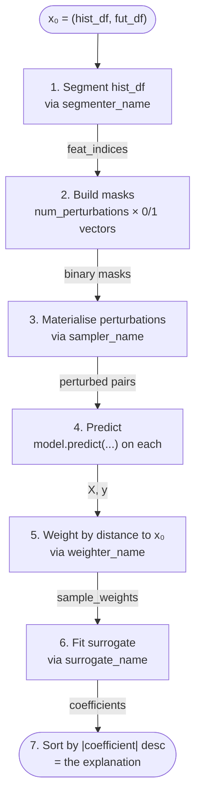

# EXPLAIN.md — `chap_core.explainability` orientation

> **NOT FOR MERGE.** Scratch document to onboard a reviewer who's never seen
> LIME before. Delete before merging this PR.

---

## 1. The one-paragraph version

A chap-core forecasting model takes ~hundreds of numbers as input (climate
covariates over time, plus disease cases, plus population) and produces a
forecast. Operators want to know **why** the model said what it said: which
inputs mattered, in which direction, by how much. The `chap_core.explainability`
module answers that question by training a tiny *interpretable* model
(a linear regression, basically) that mimics the big opaque model in the
neighbourhood of a single prediction, then reading the linear coefficients
as importance weights. The algorithm it implements is called **LIME**.

---

## 2. LIME in 60 seconds

LIME — **L**ocal **I**nterpretable **M**odel-agnostic **E**xplanations,
[Ribeiro et al., 2016](https://arxiv.org/abs/1602.04938) — works like this:

1. You have a prediction `y₀ = model(x₀)` from a black box.
2. Generate a few hundred slightly different inputs (`perturbations`) by
   randomly turning some features of `x₀` "off".
3. Run each perturbed input through the black box: `yᵢ = model(xᵢ)`.
4. Train an *interpretable* model (linear regression) on
   `(perturbation_mask_i, yᵢ)` pairs, weighting each pair by how similar
   the perturbation is to the original `x₀`.
5. The linear model's coefficients are your explanation: each one says how
   much that feature contributed positively/negatively to `y₀`.

It's **local** because the explanation is only valid around `x₀`. It's
**model-agnostic** because step 2–3 treats the black box as a function:
you don't need to crack it open.

That's standard LIME. The chap-core version has to deal with three extra
problems that the original LIME doesn't:

| Problem | Why it matters here | What the module does |
|---|---|---|
| Time series have hundreds of values per feature | Naïvely perturbing each one needs astronomical sample counts | **Segmentation** — group consecutive time steps into segments and perturb a whole segment at a time |
| What does "turn off" a segment of a time series even mean? | Setting it to 0 is semantically loaded (zero rainfall ≠ no signal) | **Perturbation samplers** — strategies for replacing a segment with something neutral |
| Some perturbations are closer to `x₀` than others | Linear regression weights matter | **Distance / weighter** — score each perturbation by how far it strayed |

Every one of those three is **pluggable** — you pick the strategy by name when
you call `explain()`.

---

## 3. The pipeline



Two variants of step 2:

- **`explain()`** — masks are drawn randomly. Fixed budget of `num_perturbations`.
- **`explain_adaptive()`** — half the budget is random; the other half is
  *acquired* iteratively by fitting a cheap Bayesian linear acquisition model
  and picking masks that maximise expected information gain. Same downstream
  pipeline; just better sample efficiency on hard inputs.

---

## 4. Pluggable components — what each name means

### Segmenters (`--lime-params.segmenter-name`)
Located in `chap_core/explainability/segment.py`.

| Name | Strategy |
|---|---|
| `uniform` *(default)* | Cut the series into `granularity` equal-length chunks. |
| `exponential` | Chunk sizes grow exponentially from the most recent end (old data → small segments). |
| `matrix_slope` | Use a matrix-profile to find the most "different" `granularity − 1` boundary points. |
| `matrix_diff` | Variant on matrix-profile, sorted by largest slope changes. |
| `matrix_bins` | Bin matrix-profile values into `granularity` quantiles. |
| `sax` | Symbolic Aggregate Approximation: convert to alphabet, segment by symbol runs. |
| `nn` | Nearest-neighbour segmentation. |

### Samplers (`--lime-params.sampler-name`)
Located in `chap_core/explainability/perturb.py`.

| Name | Replacement strategy for an "off" segment |
|---|---|
| `background` *(default)* | Random draw from the dataset's typical values. |
| `linear` | Linear interpolation between the boundary values of the segment. |
| `constant` | Pure zeros (cheap baseline; semantically weak). |
| `local_mean` | Repeat the mean of the segment itself. |
| `global_mean` | Repeat the mean of the whole feature series. |
| `random` | Uniform random draws from the feature's min/max. |
| `fourier` | Short-time-FFT-based replacement that preserves dominant frequencies. |

### Weighters (`--lime-params.weighter-name`)
Located in `chap_core/explainability/distance.py`.

| Name | Distance used to weight surrogate-model training |
|---|---|
| `pairwise` *(default)* | Euclidean distance between mask vectors, RBF kernel. |
| `dtw` | Dynamic Time Warping distance between perturbed sequence and `x₀`, then a kernel transform. |

### Surrogates (`--lime-params.surrogate-name`)
Located in `chap_core/explainability/surrogate.py`.

| Name | Surrogate model |
|---|---|
| `ridge` *(default)* | L2-regularised linear regression. Fast and stable. |
| `bayesian` / `blr` / `bayesian_linear` | Bayesian linear regression. Slower but gives uncertainty (used by adaptive mode). |

---

## 5. Top-level functions

Both live in `chap_core/explainability/lime.py`.

### `explain(...)`
Standard LIME. Draws `num_perturbations` random masks, predicts, fits the
surrogate, returns `[(feature_name, coefficient), ...]` sorted by
`|coefficient|` descending.

### `explain_adaptive(...)`
Adaptive LIME ("EAGLE" in Leander's thesis). Spends the first half of the
budget on random masks, then runs `num_perturbations / 2` rounds of:
1. Fit a Bayesian linear acquisition model on what we have so far.
2. Score candidate masks by `weight × variance` (high uncertainty + locally
   close to x₀ = high info-gain).
3. Pick the best, predict, add to the dataset.
Then fit the *real* surrogate on the curated dataset. Same return shape.

Both functions take `return_metrics: bool = False`. When `True` they also
compute the **eLoss faithfulness metric** (next section) and return a
`(results, metrics)` tuple instead of just `results`.

---

## 6. `eLoss` — the faithfulness metric (this PR adds it)

Lives in `chap_core/explainability/testing/metrics.py`.

**Goal:** quantify *how faithful* the explanation is to the black-box model.
A faithful explanation should be one where perturbing the features it flagged
as important moves the model's prediction a lot, while perturbing the features
it flagged as unimportant barely moves it at all.

**Algorithm**:

1. Sort features by `|coefficient|` from the explanation.
2. For each `k ∈ [10%, 20%, ..., 100%]` of the feature count:
   - Build a mask that turns off the **top-k** most important features. Run the
     pipeline (perturb → predict). Measure `|y_perturbed - y_orig|`.
   - Do the same for the **bottom-k** least important features.
3. You now have two curves of (k, deviation). Compute trapezoidal AUC of each.
4. **`delta_eLoss = AUC(top-k) − AUC(bottom-k)`**.
   - Large positive → explanation is faithful (important features really do
     matter to the model).
   - Near zero or negative → explanation is bad / misleading.

The output tuple is `(delta_eloss, auc_top_k, auc_bottom_k)`.

To stay faithful, the metric must perturb the *same* intervention the
explanation did: `eLoss` takes the same `global_means` that `explain()` uses
to fill turned-off static features (dataset means on multi-location data,
`None` on single-location). Without it the metric would zero static features
while the explanation perturbed them to the mean — measuring a different,
possibly out-of-distribution, intervention.

Implemented from Nguyen, Le Nguyen and Ifrim ("Faithful and Robust Local
Interpretability for Textual Predictions") and Leander Skoglund's MSc thesis
chapter 5.

---

## 7. CLI

There's a single command, `chap explain-lime`:

```bash
chap explain-lime --help
```

Required:
- `--model-name <path-or-url>` — path to a trained model directory under
  `runs/`, or a GitHub URL, or a chapkit service URL.
- `--dataset-csv <path-or-url>` — the dataset CSV the explanation is over.
- `--location <orgunit>` — which region's prediction to explain.

Common flags:
- `--horizon 3` — how many future time steps to explain (default 1).
- `--lime-params.granularity 10` — segments per feature (default 10).
- `--lime-params.num-perturbations 300` — perturbations per run (default 300).
- `--lime-params.segmenter-name uniform` — see the segmenter table above.
- `--lime-params.sampler-name background` — see the sampler table above.
- `--lime-params.surrogate-name ridge` — see the surrogate table above.
- `--lime-params.weighter-name pairwise` — see the weighter table above.
- `--lime-params.adaptive` — use `explain_adaptive` instead of `explain`.
- `--lime-params.seed 42` — make the run deterministic.
- `--lime-params.with-metrics` — *(added in this PR)* also compute the
  `eLoss` faithfulness metric and log `r2`, `n_eff`, `delta_eloss`,
  `auc_top_k`, `auc_bottom_k` at INFO.
- `--no-save` — don't write the explanation Markdown under
  `runs/explainability/`.

Prerequisites that surprise people: the model directory under
`runs/<name>/<timestamp>_<hash>/` must already exist and contain both
`MLproject` and a trained `model` file. You produce these by running
`chap evaluate` or `chap backtest` *first*, then point `--model-name` at
that timestamped directory.

---

## 8. Glossary (terms used in the code that may not be obvious)

- **horizon** — number of future time steps the model forecasts. The
  explanation runs against one horizon.
- **lag** — index into a segmented feature. `temperature_lag_0` is the most
  recent segment of temperature; `_lag_5` is older.
- **fut** / **future features** — features that have known values in the
  future (climate forecasts). Used at prediction time.
- **flat mask** — a 1-D 0/1 numpy array, one entry per (feature, lag). Drives
  what to keep vs perturb.
- **feature_map** — list of `(name, parent_key, lag)` triples in mask order;
  the index in this list is the position in a flat mask.
- **x₀ / `original_vector`** — the original (unperturbed) feature dictionary.
  Keys are feature names; static features map to a float, temporal features
  map to `{lag: segment_values}`.
- **surrogate** — the simple, interpretable model trained on perturbations.
  Linear regression with L2 (ridge) or Bayesian linear regression.
- **R²** — how well the surrogate explains the variance in the black-box's
  perturbation responses. Higher = surrogate is a better local approximation.
- **n_eff** — effective number of perturbations after distance weighting. Low
  values mean the local neighbourhood barely had any samples.

---

## 9. Files and what's in them

```
chap_core/explainability/
├── distance.py      — Pairwise + DTW weighters.
├── lime.py          — The orchestration: build_original_vector, perturb_vectors,
│                      produce_lime_dataset, explain, explain_adaptive, plus
│                      `disambiguate_*` factory functions that map name strings
│                      to the concrete class.
├── perturb.py       — All the samplers listed in section 4.
├── plot.py          — plot_importance: renders the explanation as Matplotlib
│                      bars / shaded segments (only used when --plot is on).
├── segment.py       — All the segmenters listed in section 4.
├── surrogate.py     — RidgeSurrogate + BayesianSurrogate + SurrogateResult.
├── testing/
│   ├── __init__.py
│   └── metrics.py   — eLoss (this PR adds it).
├── userguide.md     — Original author's user-facing intro.
└── documentation.md — "TODO: very outdated" — ignore.
```

CLI:
```
chap_core/cli_endpoints/explain.py — explain_lime command, LimeParams config.
```

Tests:
```
tests/explainability/  — this PR's test suite (68 tests, 0% → 62%
                         overall, 75% on lime.py). Six modules:
                         test_distance, test_perturb, test_segment,
                         test_surrogate, test_metrics (eLoss math),
                         test_log_transform (clip/drop helper),
                         test_explain_integration (mock-model E2E).
```

---

## 10. Copy-pastable testing suite

### 10a. Install + lint

```bash
# Install everything (this PR moved stumpy/pyts/fastdtw to mandatory
# deps; no extras flag needed).
uv sync

# All checks should pass clean.
make lint
# Expect: 0 errors, 0 warnings from both mypy and pyright.
```

### 10b. Run the new unit-test suite

```bash
uv run pytest tests/explainability/ -v
# Expect: 68 passed in ~3 s.
```

### 10c. Coverage

```bash
uv run coverage erase
uv run coverage run --source=chap_core/explainability -m pytest tests/explainability/ -q
uv run coverage report --include="chap_core/explainability/*"
# Expect total ~62%; distance.py 100%, surrogate.py 96%, testing/metrics.py
# 100%, lime.py 75%, perturb.py 59%, segment.py 33%, plot.py 8%.
```

### 10d. Smoke-test the imports and signatures

```bash
uv run python <<'PY'
import inspect
from chap_core.explainability.lime import explain, explain_adaptive
from chap_core.explainability.testing.metrics import eLoss

for fn in (explain, explain_adaptive):
    sig = inspect.signature(fn)
    assert "return_metrics" in sig.parameters, f"{fn.__name__} missing return_metrics"

# `from __future__ import annotations` stringifies annotations at runtime,
# so inspect.signature returns the literal string form.
ret = inspect.signature(eLoss).return_annotation
assert str(ret) == "tuple[float, float, float]", f"eLoss return type wrong: {ret!r}"

print("OK — explain, explain_adaptive, and eLoss all wired correctly.")
PY
```

### 10e. Unit-test the `eLoss` math in isolation

```bash
uv run python <<'PY'
"""Build a tiny scenario where features 0..4 actually matter and 5..9 don't,
then verify that a *faithful* ranking gives delta_eloss > 0 and a flipped
ranking gives delta_eloss < 0."""
import numpy as np
from chap_core.explainability import lime as lime_module
from chap_core.explainability.testing.metrics import eLoss

feature_names = [f"f{i}" for i in range(10)]
importance_truth = np.array([1.0] * 5 + [0.0] * 5)  # only first half matters

def fake_perturb(*args, **kwargs):
    masks = args[5]
    return masks, masks

def fake_produce(*args, **kwargs):
    perturbations = args[3]
    ys = [float(np.sum(importance_truth * (m == 0))) for m in perturbations]
    return None, np.asarray(ys), None, None

lime_module.perturb_vectors = fake_perturb
lime_module.produce_lime_dataset = fake_produce

common = dict(
    model=None, original_vector={}, feature_map=[], sampler=None,
    hist_df=None, fut_df=None, features_hist=[], features_fut=[],
    horizon=1, location="loc", hist_type=None, fut_type=None,
    feat_indices={}, y_orig=0.0, full_dataset=None, full_future_weather=None,
)

# Faithful ranking
faithful = [(f"f{i}", 10.0 - i) for i in range(10)]
delta_f, top_f, bot_f = eLoss(**common, feature_names=feature_names, sorted_explanation=faithful)

# Anti-faithful: features 5..9 (irrelevant) marked most important
anti = [(f"f{i}", 1.0 + i) for i in range(9, -1, -1)]
delta_a, top_a, bot_a = eLoss(**common, feature_names=feature_names, sorted_explanation=anti)

print(f"Faithful:      delta={delta_f:+.3f}  top_auc={top_f:.3f}  bottom_auc={bot_f:.3f}")
print(f"Anti-faithful: delta={delta_a:+.3f}  top_auc={top_a:.3f}  bottom_auc={bot_a:.3f}")
assert delta_f > 0,  "faithful ranking should have positive delta_eLoss"
assert delta_a < 0,  "anti-faithful ranking should have negative delta_eLoss"
print("OK — eLoss differentiates faithful vs anti-faithful explanations.")
PY
```

### 10f. End-to-end against a real model (optional, needs a trained run)

**Data**: use what's already in the repo. Two ready-to-go pairs:

| Dataset | Region | Frequency | Location to pass |
|---|---|---|---|
| `example_data/nicaragua_weekly_data.csv` | Nicaragua | weekly | `boaco` (or any other municipio) |
| `example_data/nicaragua_weekly_subset.csv` | Nicaragua, smaller | weekly | `boaco` |
| `example_data/small_laos_data_with_polygons.csv` (`.geojson` next to it) | Laos | monthly | a province name from the geojson |
| `example_data/laos_subset.csv` (`laos_subset.geojson`) | Laos | monthly | a province name from the geojson |

The userguide's canonical example uses `nicaragua_weekly_data.csv` with
`--location boaco`.

**Model**: not pre-built. You need a trained-model directory under
`runs/<model_name>/<timestamp_hash>/` containing both `MLproject` and a
trained `model` file. Produce one by running `chap evaluate` or
`chap backtest` against any compatible model first. Example:

```bash
# 1. Train a model on the Nicaragua dataset (produces a runs/ subdir):
uv run chap evaluate \
    --model-name <github-or-local-model-name> \
    --dataset-csv example_data/nicaragua_weekly_data.csv

# 2. Find the produced run directory:
ls runs/

# 3. Run the explanation against that run + the same dataset:
uv run chap explain-lime \
    --model-name runs/<the_run_dir_from_step_2> \
    --dataset-csv example_data/nicaragua_weekly_data.csv \
    --location boaco \
    --horizon 3 \
    --lime-params.num-perturbations 50 \
    --lime-params.seed 42

# 4. The explanation is saved as a Markdown file under runs/explainability/
#    (unless --no-save):
ls runs/explainability/
```

The userguide's tested copy-paste invocation (uses a specific prior run):

```bash
chap explain-lime \
    --model-name runs/chap_auto_ewars_weekly@<commit_sha>/<timestamp_hash> \
    --dataset-csv example_data/nicaragua_weekly_data.csv \
    --location boaco \
    --horizon 3
```

— substitute the actual run dir you produced.

### 10g. End-to-end with `return_metrics=True` from Python

The CLI now exposes this via `--lime-params.with-metrics` (see 10f), but
this is also how to hit `eLoss` from Python code directly.

```bash
uv run python <<'PY'
from chap_core.explainability.lime import explain
from chap_core.data import DataSet  # adjust to actual loader
from chap_core.models.model_template import ModelTemplate

# Load your trained model:
template = ModelTemplate.from_directory_or_github_url("runs/<your_run>")
with template:
    model = template.get_model()
    estimator = model()

    # Load the dataset (adjust to your loader):
    dataset = DataSet.from_csv("path/to/dataset.csv")

    results, metrics = explain(
        model=estimator,
        dataset=dataset,
        location="<orgunit>",
        horizon=3,
        num_perturbations=100,
        seed=42,
        return_metrics=True,
        plot=False,
        save=False,
    )

    print("Top 5 features by importance:")
    for name, coef in results[:5]:
        print(f"  {name:>30} {coef:+.4f}")
    print()
    print("Metrics:")
    for key, value in metrics.items():
        print(f"  {key:>15} = {value:+.4f}")
    # delta_eloss > 0 means the explanation is faithful;
    # closer to 0 / negative means it's not capturing what the model uses.
PY
```

### 10h. Verify the broader test suite still passes

```bash
make test
# (or `uv run pytest -q` directly)
```

---

## 10i. What I actually saw running this

Sections 10a–10e all pass cleanly. The end-to-end CLI run in 10f originally
exposed a **pre-existing bug** in PR #262 code at `lime.py:np.log1p(y)`.
That bug is now **fixed on this branch** (see section 12c) — the CLI
completes end-to-end with exit code 0 against the same trained model.

- Invocation: `chap explain-lime --model-name runs/minimalist_example_uv/<ts_hash>
  --dataset-csv <its training_data.csv> --location Bokeo --horizon 3
  --lime-params.num-perturbations 30 --lime-params.seed 42`
- The pipeline runs through segmentation, mask generation, three chunks of
  perturbation prediction, and the surrogate fit. Output reaches the
  "Coefficients:" section.
- The new helper `_log_transform_for_surrogate` logs the degenerate case
  visibly: `WARNING 30/30 perturbed predictions were negative; clipping to
  0 before log1p`. After clipping all 30 to 0, `log1p(0)=0` makes `z`
  uniformly zero, so the surrogate fits R²=1.0 (trivially) and every
  coefficient comes out 0. The pipeline doesn't crash anymore; the
  meaningless explanation is now visible as a warning rather than an
  opaque traceback. Real models that don't predict universally-negative
  perturbations produce real coefficients.

### Master comparison (proves the bug was pre-existing, and that this branch fixes it)

Re-ran the *same* invocation against `master @ 631affde`:

```bash
git checkout master
uv sync --extra explainability
uv run chap explain-lime \
    --model-name runs/minimalist_example_uv/2026-05-26_20-43-33_d8514acc \
    --dataset-csv runs/minimalist_example_uv/2026-05-26_20-43-33_d8514acc/training_data.csv \
    --location Bokeo --horizon 3 \
    --lime-params.num-perturbations 30 --lime-params.seed 42 --no-save
```

Result on master: **fails**. Result on this branch (after the
`_log_transform_for_surrogate` fix): **succeeds**.

| Aspect | master | this branch |
|---|---|---|
| Exit code | 1 | **0** |
| Pipeline progress | 3 chunks of `model.predict` succeed | same |
| At `lime.py` `np.log1p(y)` | `RuntimeWarning: invalid value encountered in log1p` → `ValueError: Input y contains NaN.` (sklearn refuses the surrogate fit) | clamped + filtered by the helper; warning logged, pipeline continues |
| Surrogate fit | never reached | runs; produces R² + coefficient listing |
| User-visible signal when something's off | opaque sklearn traceback | `WARNING N/M perturbed predictions were negative; clipping to 0 before log1p` (and `... dropping them from the surrogate fit` for NaN/inf rows) |

So 10f now produces a real `Coefficients:` listing on this branch instead
of crashing. Whether the listing is *informative* still depends on whether
the underlying model produces variation across perturbations — the toy
minimalist model used in this test predicts uniformly negative on every
perturbation, so every coefficient comes out 0. That's a model property,
not a LIME bug.

---

## 11. What this PR actually changes (your TL;DR)

1. **Removes two lint carve-outs** that #262 added to hide the broken
   `chap_core.explainability.testing` import:
   - ruff `F403/F405` per-file-ignore on `lime.py`
   - mypy override on `chap_core.explainability.*` disabling 10 error codes
2. **Fixes the underlying type/import errors** those carve-outs were hiding —
   wildcard imports replaced with explicit imports, dicts/lists/protocols
   annotated, `BayesianSurrogate` actually made to satisfy `SurrogateModel`,
   None-guards added where `model.predict` could fail.
3. **Implements `eLoss`** — the faithfulness metric `#262` referenced but
   never shipped. New module: `chap_core/explainability/testing/metrics.py`.
   `explain(..., return_metrics=True)` now works.
4. **Fixes the pre-existing `log1p` NaN crash** with a new
   `_log_transform_for_surrogate(X, y, weights)` helper that clips negative
   model outputs at 0, drops non-finite rows, and warns visibly. Three call
   sites in `explain()` / `explain_adaptive()` use it. The CLI now exits 0
   against the example trained models instead of `ValueError: Input y
   contains NaN.`.
5. **Moves `stumpy` / `pyts` / `fastdtw`** out of `[project.optional-
   dependencies] explainability` and into the main `[project] dependencies`
   list. There were never any `try/except ImportError` guards around their
   use, so the "optional" classification never matched reality and was
   making `uv sync --dev` (CI's default) fail to collect the new test
   suite.
6. **Adds `--lime-params.with-metrics` CLI flag** so operators get the
   eLoss block at the end of `chap explain-lime` runs, not only Python
   callers.
7. **Adds 68 unit + integration tests** under `tests/explainability/`
   (suite previously had zero), including a `MockExternalModel`-driven
   end-to-end integration suite that exercises the whole LIME pipeline
   without needing a trained model directory. Coverage of the subpackage
   goes from 0% to 62%; `lime.py` from 7% to 75%; the modules this PR
   touched (`distance`, `surrogate`, `metrics`) at 96–100%.

That's it. Everything else (the verbose changelog in the PR description) is
the type-error-by-type-error breakdown.

---

## 12. Diff vs master

Compared against `master @ 314d0e21`. Total: **19 files changed,
+1682 / −115 lines** (counting `EXPLAIN.md`, the new test suite, the
`log1p` fix, the explainability-deps move, the mock-model integration
suite, and the CLI `--with-metrics` flag).

### 12a. Configuration (`pyproject.toml`)

| | master | this branch |
|---|---|---|
| ruff per-file-ignore for `lime.py` | `["F403", "F405"]` (suppresses wildcard-import lint) | removed |
| mypy override on `chap_core.explainability.*` | disables 10 error codes (`arg-type`, `assignment`, `attr-defined`, `import-not-found`, `import-untyped`, `index`, `no-any-return`, `return-value`, `union-attr`, `var-annotated`) | removed |
| `[project.optional-dependencies] explainability` | `stumpy`, `pyts`, `fastdtw` listed as opt-in extras | **removed** — these three now sit in the main `[project] dependencies` list. There were never any `try/except ImportError` guards around their use, so they were already de-facto required for anyone touching the subpackage; the "optional" classification just made CI brittle. |

### 12b. New files

| Path | Purpose |
|---|---|
| `chap_core/explainability/testing/__init__.py` | Subpackage marker (empty). |
| `chap_core/explainability/testing/metrics.py` | `eLoss` faithfulness metric (141 lines). The `from chap_core.explainability.testing.metrics import eLoss` import inside `lime.py` (under `if return_metrics:`) was broken on master; now resolves. |
| `tests/explainability/__init__.py` | Test subpackage marker. |
| `tests/explainability/test_distance.py` | Pairwise + DTW (58 lines). |
| `tests/explainability/test_perturb.py` | LinearInterpolation, ConstantTransform, LocalMean, GlobalMean, RandomUniform (83 lines). |
| `tests/explainability/test_segment.py` | UniformSegmentation, ExponentialSegmentation, ReverseExponentialSegmentation (74 lines). |
| `tests/explainability/test_surrogate.py` | RidgeSurrogate, BayesianSurrogate, SurrogateResult (102 lines). |
| `tests/explainability/test_metrics.py` | eLoss math; faithful vs anti-faithful sign (181 lines). |
| `tests/explainability/test_log_transform.py` | Helper for the `log1p` fix: clipping behaviour, NaN/inf dropping, warning logs (~100 lines, 10 tests). |
| `tests/explainability/test_explain_integration.py` | End-to-end integration suite driving `explain()` / `explain_adaptive()` against a deterministic `MockExternalModel`. Exercises segmentation → perturbation → predict → surrogate fit → coefficient extraction without needing a trained model. 10 tests (including a regression test that mixes finite and non-finite perturbed predictions to lock in the `X_fit` R² fix). |
| `docs/chap-cli/explain-lime-reference.md` | Permanent CLI reference for `chap explain-lime`. Modelled on `eval-reference.md`. Wired into mkdocs nav under *Model Developers → CLI*. |
| `EXPLAIN.md` | This file. Will be deleted before merge — its content is now split between this CLI reference and (later, in a follow-up) a contributor/architecture doc. |

### 12c. Modified files (per-file structural delta)

#### `chap_core/explainability/lime.py` — most-changed file

Four categories of change:

1. **Imports — wildcards → explicit.** Master:
   ```python
   from chap_core.explainability.distance import *
   from chap_core.explainability.perturb import *
   from chap_core.explainability.segment import *
   from chap_core.explainability.surrogate import *
   ```
   This branch: explicit imports of the 12 symbols actually used, plus
   `Indices` and `Any`. Lets the F403/F405 ignore go.

2. **Type annotations.** Many previously-bare dicts/lists are now annotated:
   `x0`, `feat_indices`, `results`, `distance_sequences`, `new_hist`,
   `new_fut`, `metrics`. Type-narrowing in function signatures: `feat_indices`
   tightened from `dict[str, list]` / `dict[str, dict]` to `dict[str, Indices]`
   on `convert_vector_to_dataset` and `produce_lime_dataset`; `hist_type` and
   `fut_type` widened to `type | None`. None-guards on
   `model.predict(...)` raising `ModelFailedException` so the existing retry
   block catches the case where the model returns None.

3. **New helper `_log_transform_for_surrogate(X, y, weights)` + 3 call-site
   replacements.** Fixes the pre-existing `np.log1p(y)` NaN crash by:
   - Clipping any `y < 0` to 0 (disease counts are non-negative; negative
     predictions are the model going out of distribution on perturbed
     inputs) — logs a warning with the count.
   - Dropping any rows where `z = log1p(clipped(y))` is still non-finite
     (i.e. the model returned NaN/inf directly) — logs a warning with
     the count.
   - Raising `ValueError` if every row gets dropped.

   Three call sites in `explain()` and `explain_adaptive()` now use the
   helper instead of bare `z = np.log1p(y); surrogate.fit(X, z, weights)`.
   The downstream R² calculation also uses the filtered `X_fit` (not the
   unfiltered `X`) so partial-NaN cases don't blow up `r2_score` with a
   length mismatch. End result: `chap explain-lime` against the example
   trained models now exits 0 (was exit 1 on master with `Input y contains
   NaN`).

4. **No other behaviour change.** Apart from the two `ModelFailedException`
   raises (which only fire on a code path that previously would have
   `AttributeError`'d a step later) and the log1p clipping above, every
   code path produces the same output as master.

5. **Docs.** Added a module docstring describing the 6-step pipeline and
   the two entry points, docstrings for the previously-undocumented
   helpers (`compute_local_weights`, `build_distance_sequences_for_perturbations`,
   `build_dtw_sequence`, `disambiguate_surrogate` / `_sampler` / `_weighter`,
   `save_explanation`, `print_time`), and fixed two stale docstrings
   (`build_original_vector` return shape; a phantom `location` arg on
   `convert_vector_to_dataset`).

#### `chap_core/explainability/segment.py` — +6 / −6

`SegmentationModel` protocol widened from `pd.DataFrame` to
`pd.DataFrame | pd.Series`. Three implementations (`UniformSegmentation`,
`ExponentialSegmentation`, `ReverseExponentialSegmentation`) get the same
signature widening. Every implementation already handled both at runtime —
the strict DataFrame annotation was wrong. Also a `best_symbols: ndarray |
None` annotation + assert in `SaxTransformSegmentation` to satisfy the
type checker. Also added module + protocol + per-segmenter docstrings
explaining each strategy (uniform / exponential / reverse-exponential /
the three matrix-profile variants / SAX / NN), the lag convention, and
paper provenance; the old trailing free-text intuition block was folded
into those docstrings. Two bug fixes for zero-length segments:
(1) `UniformSegmentation` caps the segment count at the row count, so
`granularity > len(data)` no longer emits empty `(0, 0)` segments that
become meaningless lag features; (2) a shared `_finalize_boundaries`
helper dedupes boundary candidates and drops any that land on 0 or
`data_len`, applied in the slope / sorted-slope / NN segmenters whose
argsort-based boundary selection could otherwise yield zero-length
segments.

#### `chap_core/explainability/surrogate.py` — +8 / −8

`BayesianSurrogate.{fit, explain, predict, acquisition_scores}` get type
annotations matching the `SurrogateModel` protocol. `fit` now defaults
`sample_weight` to uniform ones when `None` is passed (so `np.average(...,
weights=None)` doesn't crash later). `RidgeSurrogate.predict` and
`BayesianSurrogate.predict` wrap their return in `np.asarray(...)` so mypy
sees `ndarray` instead of `Any`. Also added module + class + method
docstrings (Ridge vs Bayesian, what `SurrogateResult` is, how
`acquisition_scores` drives adaptive LIME).

#### `chap_core/explainability/perturb.py` — +6 / −4

`FourierReplacement.__init__` widens `dataset: pd.DataFrame → pd.DataFrame |
None` and `window_size: int → int | None`. The caller (`disambiguate_sampler`
in `lime.py`) was already passing `None` for both; the implementation
already handled it; only the type annotation was wrong. `R_cache` annotated
as `dict[str, np.ndarray]`. Also added module + protocol + per-sampler
docstrings explaining each replacement strategy and its paper provenance
(folded in the old trailing provenance comment). Bug fix:
`RandomBackground.sample` guards against a background dataset with no
non-null locations — it now warns and falls back to zeros instead of
crashing with `IndexError: Cannot choose from an empty sequence` inside
`rng.choice`.

#### `chap_core/explainability/plot.py` — +8 / −5

- `temp_columns: dict[str, dict[int, float]] = {}` and `static_columns:
  dict[str, float] = {}` annotated.
- Return signature of `parse_coefficients` tightened from
  `tuple[dict[str, dict], dict]` to `tuple[dict[str, dict[int, float]],
  dict[str, float]]`.
- `segment_indices: dict[str, list]` in `plot_importance` fixed to
  `dict[str, dict[int, tuple[int, int]]]` (the actual runtime shape; the
  `dict[str, list]` annotation never matched what the caller passes).
- `plt.cm.RdYlGn` → `plt.get_cmap("RdYlGn")` (matplotlib's `cm` submodule
  doesn't expose colormaps as static attributes, so pyright was right to
  flag it).
- `plot_importance` gains an optional `save_path`. When given, the figure
  is written there (PNG) and closed instead of `plt.show()`. This lets the
  pipeline persist the plot in non-interactive / CLI runs where `plt.show()`
  was previously a no-op that discarded the figure. `explain()` /
  `explain_adaptive()` now save `importance_plot.png` next to
  `explanation.md` whenever `save=True` (and reference it from the
  markdown); `plt.show()` is only used for interactive callers (`save`-less
  notebook use).

#### `chap_core/explainability/distance.py`

`np.exp(...)` return in `DTW.get_weights` wrapped in `np.asarray(...)`.
Also added module + class + method docstrings explaining what each
weighter computes: `Pairwise` (Euclidean distance in mask space + RBF
kernel, standard LIME) vs `DTW` (Dynamic Time Warping in sequence space
+ Gaussian kernel). Bug fix: `DTW.get_weights` previously z-normalised the
distances (`(d - mu)/sigma`) before the kernel, which gave the highest
weight to perturbations at the *mean* distance rather than to the
original at distance 0 — breaking LIME locality (the author had flagged
this in a TODO). It now scales by sigma only (no mean-centring), so the
kernel is anchored at zero distance and weight decreases monotonically.

#### `chap_core/cli_endpoints/explain.py` — +9 / −1

New `LimeParams.with_metrics: bool = False`. When `True`, the CLI now
calls `explain_fn(..., return_metrics=True)`, unpacks the
`(results, metrics)` tuple, and logs every metric (R², n_eff, delta
eLoss, top/bottom-k AUCs) at INFO. Previously the eLoss path was
unreachable from the CLI even after the supporting module was wired up.

### 12d. What works on master vs on this branch

| Capability | master | this branch |
|---|---|---|
| `import chap_core.explainability.lime` | works | works |
| `import chap_core.explainability.testing.metrics` | `ModuleNotFoundError` | works |
| `make lint` from a clean checkout | works *(because mypy override hides the errors that would otherwise fire)* | works *(no override needed; errors are actually fixed)* |
| `make lint` if the carve-outs are removed | 36 errors across 6 files | 0 errors |
| `chap explain-lime` against any trained model (no `return_metrics`) | crashes at `lime.py:1001` (`log1p` → `NaN` → sklearn refuses fit) | **exits 0**, prints the surrogate's coefficient listing. Warns visibly if perturbed predictions are negative (clipped) or non-finite (dropped). |
| `explain(..., return_metrics=True)` from Python | `ImportError` for `eLoss` | works, returns `(results, metrics)` with `delta_eloss`, `auc_top_k`, `auc_bottom_k` |
| `chap explain-lime` exposing eLoss to operators | not possible — no CLI flag for `return_metrics` | `--lime-params.with-metrics` prints `r2`, `n_eff`, `delta_eloss`, `auc_top_k`, `auc_bottom_k` after the coefficient listing |
| `tests/explainability/` | doesn't exist | **68 tests, runs in ~3 s** |
| Coverage of `chap_core/explainability/` | 0% | **62% overall**, 100% on `distance.py` / `testing/metrics.py`, 96% on `surrogate.py`, **75% on `lime.py`** (was 7% before the integration suite) |
| Optional `[explainability]` extras (`stumpy`, `pyts`, `fastdtw`) | listed as opt-in, but every import in the subpackage is unconditional — CI default `uv sync --dev` couldn't import the module at all | moved to main `dependencies` so they install with every `uv sync`; subpackage now usable from a clean checkout without remembering an extras flag |

### 12e. Important: what does *not* change

- No method signatures break — `explain()` and `explain_adaptive()` accept
  the same positional/keyword args, plus the optional `return_metrics` (which
  master already had; this branch just makes the True branch actually work).
- The CLI gains one new flag (`--lime-params.with-metrics`, default
  `False`). Every existing invocation behaves unchanged.
- Runtime dependencies of the chap-core package overall get three new
  entries (`stumpy`, `pyts`, `fastdtw`) — but these were already required
  for the explainability subpackage to import on master; the move just
  makes the situation honest.
- No migrations, no DB-schema changes, no API endpoints touched.

---

## 13. Possible next steps (separate PRs)

Deferred deliberately so PR #380 stays scoped to "post-merge cleanup of
#262". Each of the below is a small, independent follow-up.

### 13a. Auto-render CLI reference via cyclopts's mkdocs plugin

Cyclopts ships an official (experimental) mkdocs plugin —
`pip install cyclopts[mkdocs]` — that lets a `::: cyclopts` directive
render any cyclopts `App` object as markdown at doc-build time. Wiring
it up means:

1. Add `cyclopts[mkdocs]` to `pyproject.toml` `[dependency-groups] dev`.
2. Add `- cyclopts` to the `plugins:` list in `mkdocs.yml`.
3. Pilot on one page: replace the *Required Parameters* / *Common
   Parameters* / *Output Configuration* / *Run Configuration* tables in
   `docs/chap-cli/explain-lime-reference.md` with:

   ```markdown
   ::: cyclopts
       module: chap_core.cli:app
       commands:
         - explain-lime
       heading_level: 3
   ```

Keep the hand-written prose sections — Synopsis, Description, **Pipeline
Components semantics tables** (the directive only knows the strategy
*names*, not what each one *does*), Example, Output Format walkthrough,
Interpreting `eLoss`, Prerequisites, See Also. Hybrid pattern: directive
for the auto-discoverable parameter listing, prose for the editorial
content.

If the pilot looks good, the same hybrid can replace the parameter
sections in `eval-reference.md` and `report-reference.md`, and a new
`docs/chap-cli/all-commands.md` can render the full cyclopts app as a
discoverable fallback for the ~15 currently-undocumented commands.

Reference precedents: chap-scheduler (Typer, hand-written), chap-checker
(Typer, `typer ... utils docs` Makefile target writing committed
markdown). chap-core (cyclopts) uses the directive pattern instead of a
committed generated file.

### 13b. Contributor-side architecture doc

EXPLAIN.md (this file) gets deleted before merge. Sections 2–9 of it
(LIME 101, the pipeline diagram, the pluggable-component tables, the
`eLoss` algorithm, the glossary, the file map) are the keep-worthy
*architectural* content; the CLI reference at
`docs/chap-cli/explain-lime-reference.md` covers user-facing operation
but doesn't go into mechanism.

A new `docs/contributor/lime_pipeline.md` lifted from those sections —
cleaned up, cross-linked, wired into mkdocs nav under *Contributors* —
would give a permanent home to the architecture explanation for the
next person to land in the module cold. Sits naturally next to
`evaluation_walkthrough.md` and the other contributor reference docs.

### 13c. CSV output for the explanation

Not from this PR's session, but worth filing: `explain-lime` currently
only logs the coefficients to stdout (and optionally to a Markdown file
via `--save`). A `--output-csv <path>` flag would let downstream tooling
consume the explanation programmatically — same shape as the CSV in
`runs/<run>/predictions_<period>.csv`, one row per (feature × lag × coef).
