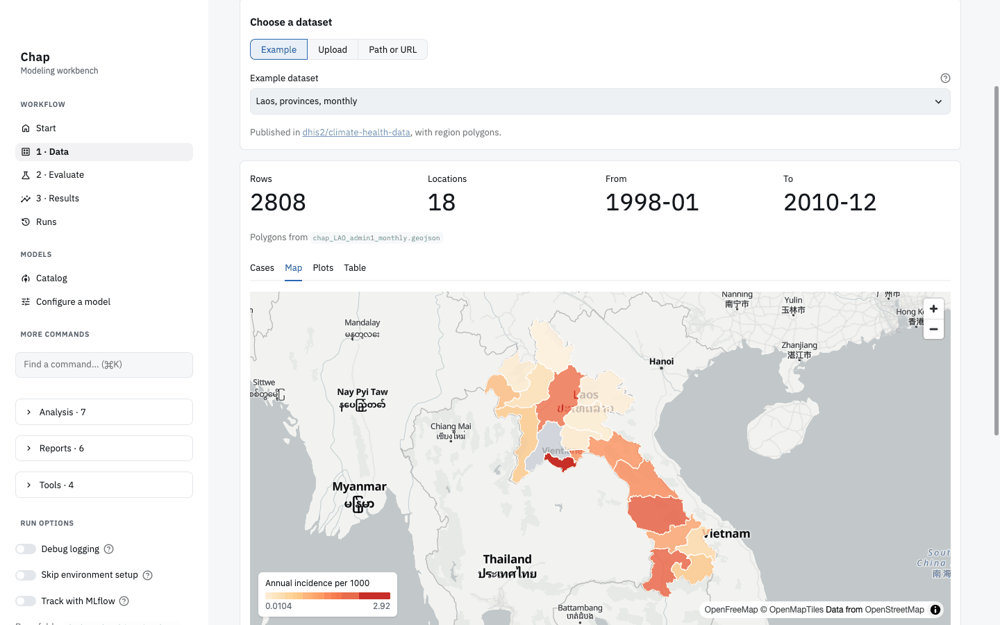
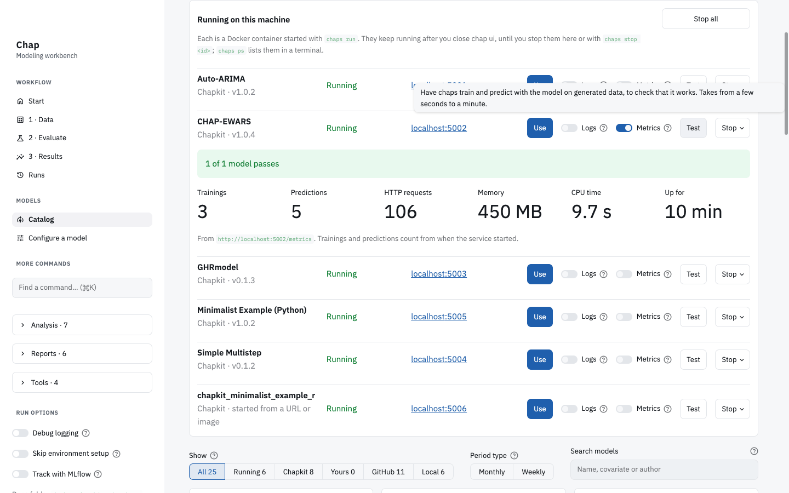
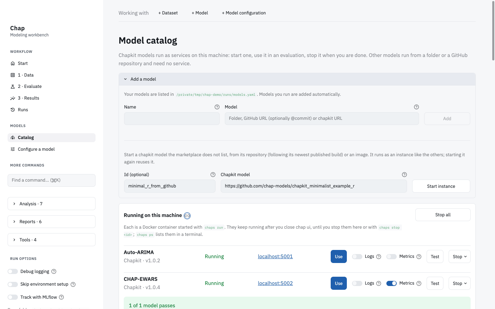
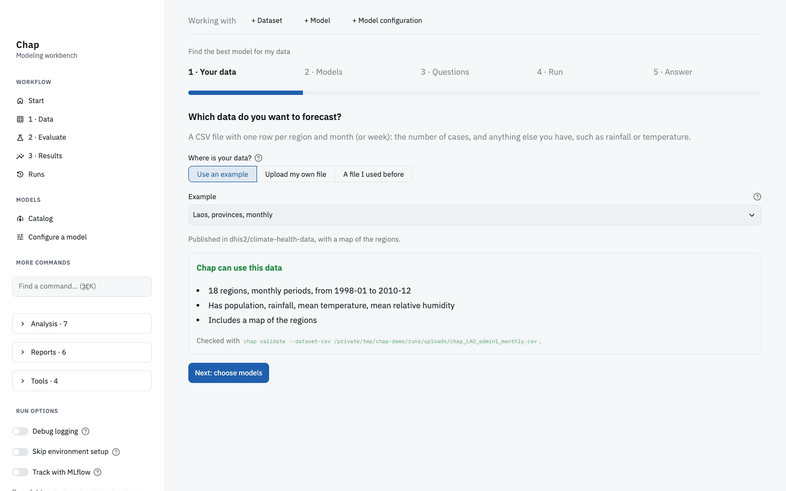
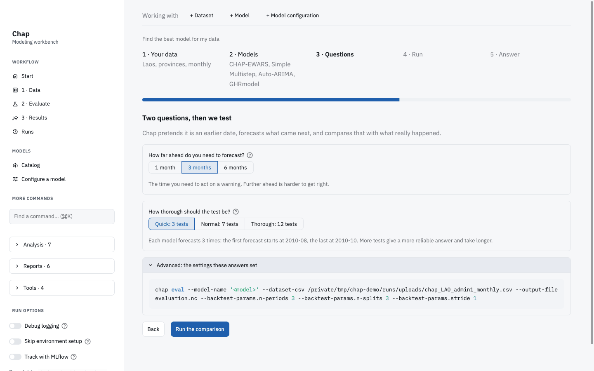
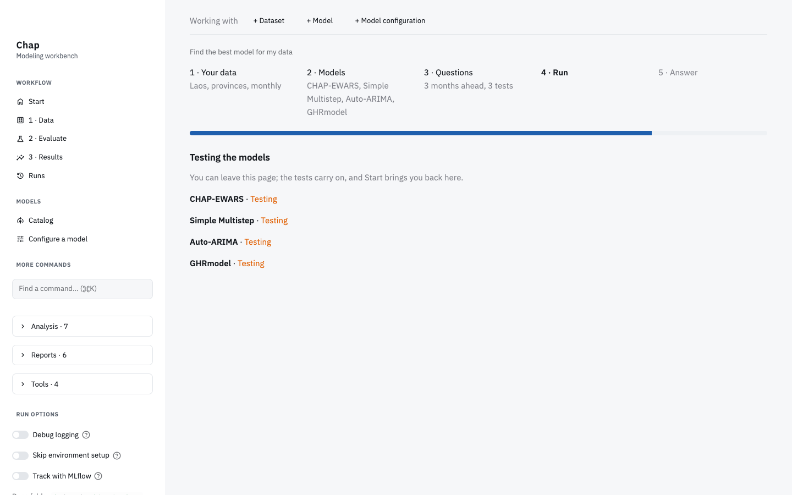
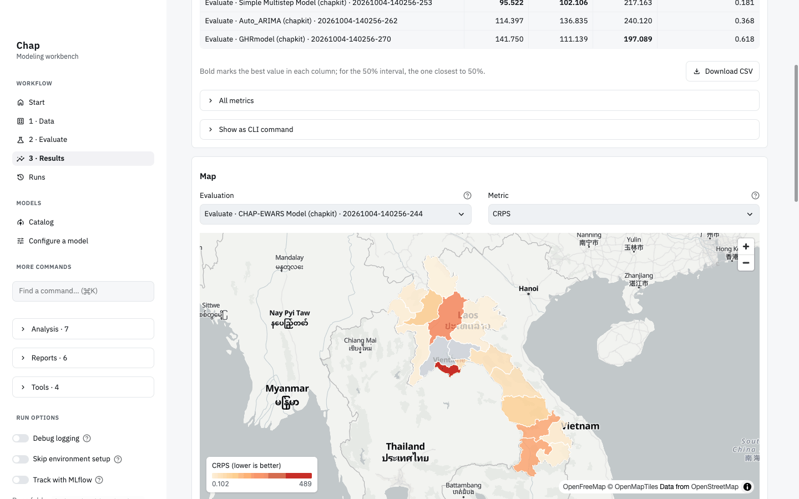
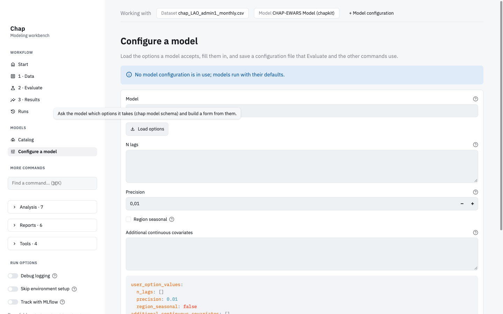
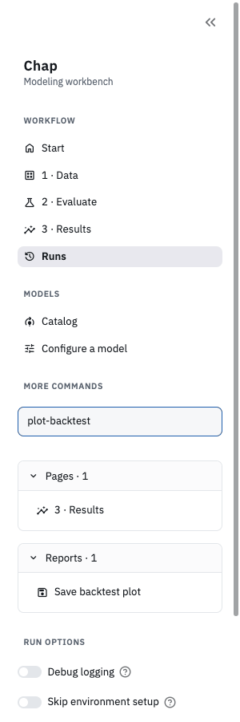

# Walkthrough: compare models in the browser

This walkthrough uses `chap ui` to find the best of four forecasting models for the Laos province data, step by step. Along the way it starts chapkit models, checks that one works, adds a model the marketplace does not list, and looks at the results on a map. [Chap in the browser](ui.md) describes every page in more detail.

You need:

- `chap ui`, as in [Install and start](ui.md#install-and-start).
- Docker, running.
- [chaps](https://github.com/winterop-com/chaps) 0.99.3 or newer, for the steps that start models. Without chaps the models start as plain Docker containers; see [Without chaps](#without-chaps).
- Disk space and time for the first start of each model: the images are between 1 and 7 GB. Later starts reuse them.

Every page has tooltips: hover a button, or the **?** next to a field, to see what it does.

## 1. Start chap ui

```console
uv run chap ui
```

The browser opens on **Start**, which asks what you want to do. The sidebar has the workflow pages, the model **Catalog**, and every other command under **More commands**.


## 2. Look at the data

Open **1 · Data**, choose **Example** and **Laos, provinces, monthly**. The dataset is published in [dhis2/climate-health-data](https://github.com/dhis2/climate-health-data) and is downloaded with a map of the provinces: 18 provinces, monthly, from 1998-01 to 2010-12.


The **Map** tab colours each province by its annual incidence. A grey province has no case counts: Vientiane Province has none in this dataset.



## 3. Start the models

Open **Catalog**. It lists the marketplace models, your own models and the models of a chap-core checkout, with each model's status, covariates and the forecast horizons it supports.


Click **Start** on a chapkit model. A dialog says what happens before anything starts: the model runs as a Docker container started with `chaps run`, answers on `localhost`, and keeps running until you stop it. **Port and network** sets a fixed port or lets other machines reach the model. Click **Start instance**.


Do this for **CHAP-EWARS**, **GHRmodel**, **Simple Multistep** and **Auto-ARIMA**. They appear under **Running on this machine**, the same list `chaps ps` shows in a terminal. The Minimalist Examples are templates for model authors; they start too, but the comparison below leaves them out.


## 4. Check that a model works

On the CHAP-EWARS row, click **Test**: chaps trains and predicts with the model on generated data and reports **1 of 1 model passes**. Turn on **Metrics** to see what the model reports about itself: trainings, predictions, HTTP requests, memory, CPU time and uptime. **Logs** shows the newest log lines first.



## 5. Add a model the marketplace does not list

Open **Add a model** at the top of the catalog. Under **Chapkit model**, give a chapkit model's GitHub repository or a Docker image, here `https://github.com/chap-models/chapkit_minimalist_example_r`, optionally with an id, and click **Start instance**. chaps runs the newest published build of the repository.



## 6. Find the best model for the data

On **Start**, click **Start** under **Find the best model for my data**.

**Your data.** Choose **Use an example** and the Laos data. Chap checks it at once and says whether it can use it.



**Models.** Only the models that fit the data are offered, each with the reason. Models already running are marked and listed first. Tick CHAP-EWARS, Simple Multistep, Auto-ARIMA and GHRmodel. Rwanda Malaria BYM is listed as not fitting: it needs a `relative_humidity` column.


**Questions.** Choose **3 months** ahead and **Quick: 3 tests**. **Advanced** shows the `chap eval` command the answers set.



**Run.** Chap tests the four models side by side. You can leave the page; **Start** brings you back. Here it took under three minutes: Simple Multistep 13 seconds, Auto-ARIMA 27, CHAP-EWARS 68 and GHRmodel 161, the two R-INLA models taking longest.



**Answer.** The winner has the best overall score, the CRPS, which rewards a model for knowing how uncertain it is as well as for being close.


In this run:

| Model | Overall score (CRPS) | Off by, on average (MAE) | Within its likely range |
|---|---:|---:|---:|
| Simple Multistep | 95.5 | 102.1 | 38% |
| CHAP-EWARS | 102.1 | 145.0 | 76% |
| Auto-ARIMA | 114.4 | 136.8 | 48% |
| GHRmodel | 141.7 | 111.1 | 78% |

Simple Multistep came closest, but its likely range held the real number of cases only 38% of the time; a model that knows how uncertain it is gets close to 80%. CHAP-EWARS and GHRmodel are better calibrated.

The models draw random samples, so another Quick run can rank close models differently: in an earlier run of the same test CHAP-EWARS came first with 96.1 against 96.7 for Simple Multistep. For a decision, choose **Normal** or **Thorough**.

## 7. Look at the details

Click **Open Results**. The four evaluations are compared side by side; bold marks the best value in each column, and **Download CSV** saves the table.


Under **Map**, pick an evaluation and a metric to see where a model does well or badly.



The plots compare each model's forecasts and their uncertainty with what was observed, for a split period and a province.


## 8. Evaluate a model by hand

The guided comparison runs `chap eval` with settings from your answers. To choose them yourself, pick a model with **Use** in the catalog and open **2 · Evaluate**: set the periods to forecast, the number of test splits and the periods between them, and click **Run evaluation**. The diagram shows the training data and each forecast window.


## 9. Configure a model

Open **Configure a model** and click **Load options**: the form is built from the options the model declares, here CHAP-EWARS's lags, precision and seasonal effects. Save it, and Evaluate and the other commands pass the file to the model.



## 10. Runs and other commands

**Runs** lists every run with its status, how long it took, its log and outputs.


**Find a command** in the sidebar, or Ctrl+K (⌘K on a Mac), finds any page by its title or CLI name: `plot-backtest` finds Results and Save backtest plot.



## Without chaps

Without chaps on the PATH, **Start** runs the model's image with `docker run`, on `127.0.0.1` and a free port, and **Stop** removes the container; it keeps no data. A model whose image is built only for amd64, such as Rwanda Malaria BYM, runs under emulation on a Mac with Apple silicon. Containers that something else started, such as chaps, are listed and can be used, but not stopped from here.

## Stop the models

Under **Running on this machine**, **Stop** on a row stops one model, keeping its data unless you choose **Stop and delete its data**; **Stop all** stops the models in chap ui's own group. In a terminal:

```console
chaps stop chapkit_ewars_model
```

## What each step runs

| In the browser | In a terminal |
|---|---|
| Check the data | `chap validate --dataset-csv data.csv` |
| Start, list and stop models | `chaps run <id>`, `chaps ps`, `chaps stop <id>` |
| Test a model | `chaps models test <id>` |
| Evaluate a model | `chap eval --model-name http://localhost:5002 --dataset-csv data.csv --output-file evaluation.nc --backtest-params.n-periods 3 --backtest-params.n-splits 3` |
| Compare evaluations | `chap export-metrics`, `chap plot-backtest` |

Every page has **Show as CLI command**, and every run keeps the command it ran in `command.txt` in its folder.
