# Chap in the browser: chap ui

`chap ui` starts a local web app that does what the `chap` commands do, without typing them. You pick a dataset, choose a model, run an evaluation and compare the results in your browser. Every run goes through the same commands as the CLI, and each page shows the command it runs, so you can repeat or script anything you did in the browser.

The app runs on your own machine and is only reachable from it.

For a step-by-step example with four models, see [Walkthrough: compare models in the browser](ui-walkthrough.md).

## Install and start

From a chap-core checkout:

```console
uv sync --extra ui
uv run chap ui
```

Without a checkout:

```console
uvx --from 'chap-core[ui]' chap ui
```

The browser opens at `http://localhost:8501`. Stop the app with Ctrl+C in the terminal.

The app needs the optional `ui` dependencies. Plain `uvx --from chap-core chap ui` stops with a hint that says how to get them.

`chap ui` runs on macOS and Linux. On Windows, run it inside WSL, as the rest of Chap (see [Install Chap Core](chap-core-cli-setup.md)).

### chaps, for chapkit models

[chapkit](https://github.com/dhis2-chap/chapkit) models run as services, which `chap ui` starts for you. It does that with [chaps](https://github.com/winterop-com/chaps) 0.99.3 or newer when it is installed:

```console
curl -fsSL https://raw.githubusercontent.com/winterop-com/chaps/main/install.sh | sh
chaps doctor
```

`chaps doctor` checks Docker and the rest. Without chaps, `chap ui` starts chapkit models as plain Docker containers. Docker is needed either way. Models that run from a folder or a GitHub repository need neither.

## Start: what do you want to do?

`chap ui` opens on **Start**, which asks what you want to do rather than which command to run:

- **Find the best model for my data** walks you through a comparison, step by step (below).
- **Check a model I built** and **Look at a dataset** open the matching page. Guided versions of these will follow.
- **Forecast the coming months** is not available in the browser yet: chap-core has no command that forecasts your own data with a marketplace model. The legacy `chap forecast` command, which works on built-in datasets, is under **More commands**.

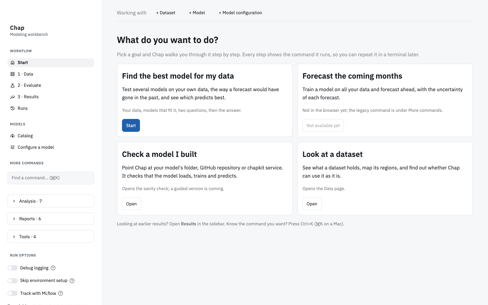

### Find the best model for my data

A guided comparison in five steps:

1. **Your data:** pick an example, upload a file, or reuse an earlier one. Chap checks it at once and says, in plain words, whether it can use it: how many regions, which periods, and which covariates it has.
2. **Models:** the marketplace models that fit your data, each with the reason it fits, such as "uses rainfall and mean temperature, all in your data". Models that cannot use your data are listed separately with the reason, such as a column your data does not have. Models already running on this machine are marked, listed first and picked by default, since they start at once.
3. **Questions:** how far ahead you need to forecast, and how thorough the test should be. Chap turns the answers into the backtest settings of `chap eval`, shown under **Advanced**, and only offers choices your data is long enough for.
4. **Run:** Chap starts the models that are not running yet and tests each of them. You can leave the page; **Start** brings you back.
5. **Answer:** which model forecast best, in words and in a table. The winner has the best overall score, the CRPS, which rewards a model for knowing how uncertain it is as well as for being close; when another model came closer on average, the answer says so. "Off by" is the mean absolute error, and the likely range is the 10-90% band of the forecasts. From here you can open the details in Results, or stop the models the comparison started. With chaps their data is kept; without chaps their containers are removed.

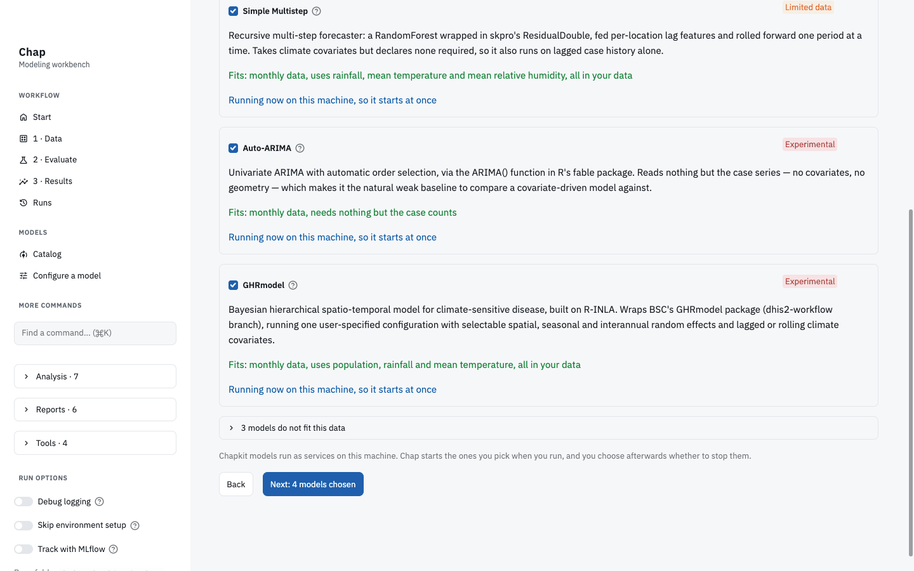

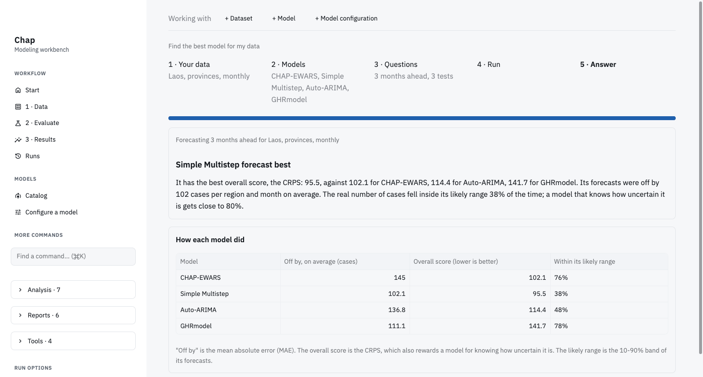

## The workflow

The sidebar also gives direct access to every page, in the usual order: Data, Evaluate, Results, and Runs. A bar at the top shows the dataset, model and model configuration you are working with; every page uses them.

### Data

Choose an example dataset, upload a CSV file, or give a path or URL.

- **Examples:** the Laos, Thailand and Vietnam datasets published in [dhis2/climate-health-data](https://github.com/dhis2/climate-health-data) are always offered. They are downloaded, with their region polygons, the first time you pick one.
- **Exploring:** the page shows the dataset's size and time span. Its tabs show the cases over time, a map of the regions, the dataset plots of `chap plot-dataset`, and the raw table. The map needs a GeoJSON file with the same name as the CSV file.
- **Validate** runs `chap validate`, optionally against a model, and lists any problems.

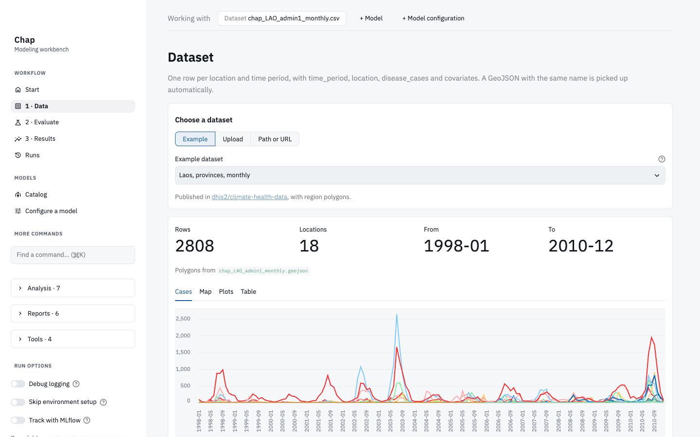

### Evaluate

Pick a model, adjust the backtest and run it. This is `chap eval`.

- **Backtest:** set how many periods each forecast covers, how many forecasts to make, and how far apart they start. A diagram shows where each forecast falls in the data.
- **Model configuration:** use a configuration file, if the model takes one. **Configure a model** in the sidebar loads a model's options and saves a file for you.
- **Other settings**, such as hyperparameter search and run options, sit in folded sections.

The run continues in the background, so you can leave the page. **Show as CLI command** gives the `chap eval` command it runs.

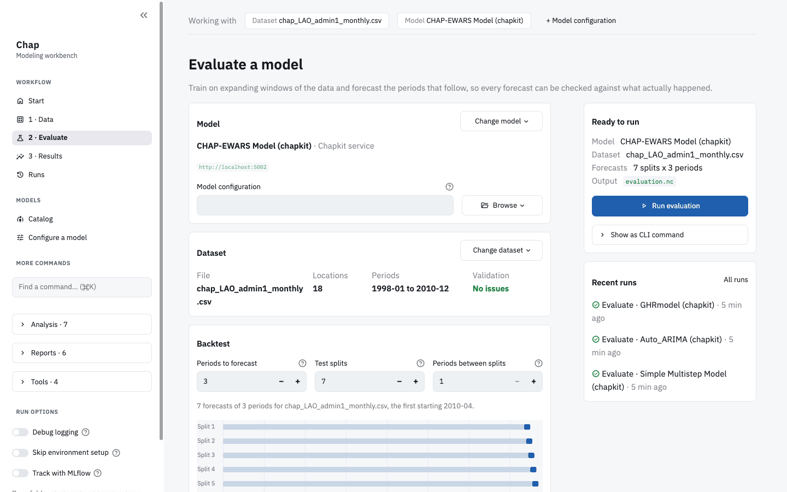

### Results

Compare evaluations side by side. The metrics table marks the best value in each column, and **Download CSV** saves it (`chap export-metrics`).

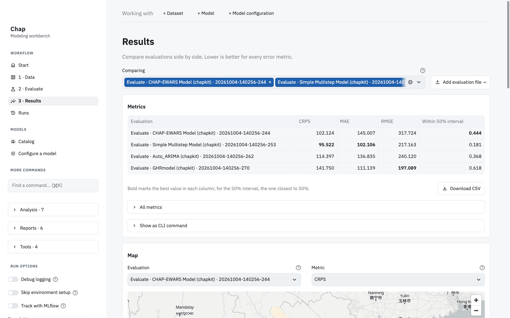

Below the table, a map colours each region by a metric, and the plots of `chap plot-backtest` show the forecasts against what happened, one forecast and location at a time.

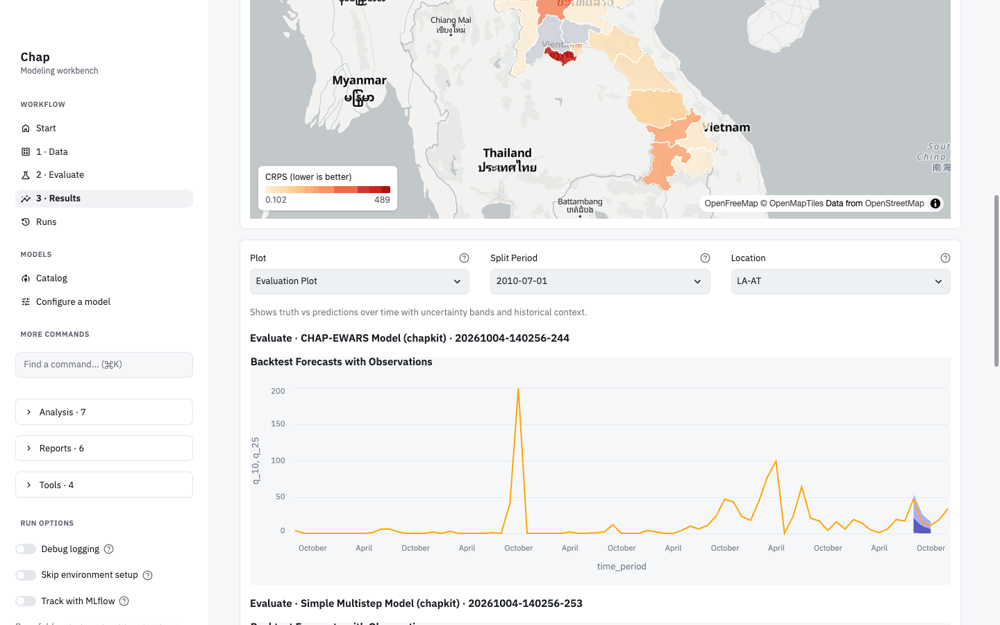

### Runs

Every run started from the app is listed with its status, log and output files. Runs survive closing the browser and restarting the app. From here you can open a run in Results, run it again or delete it.

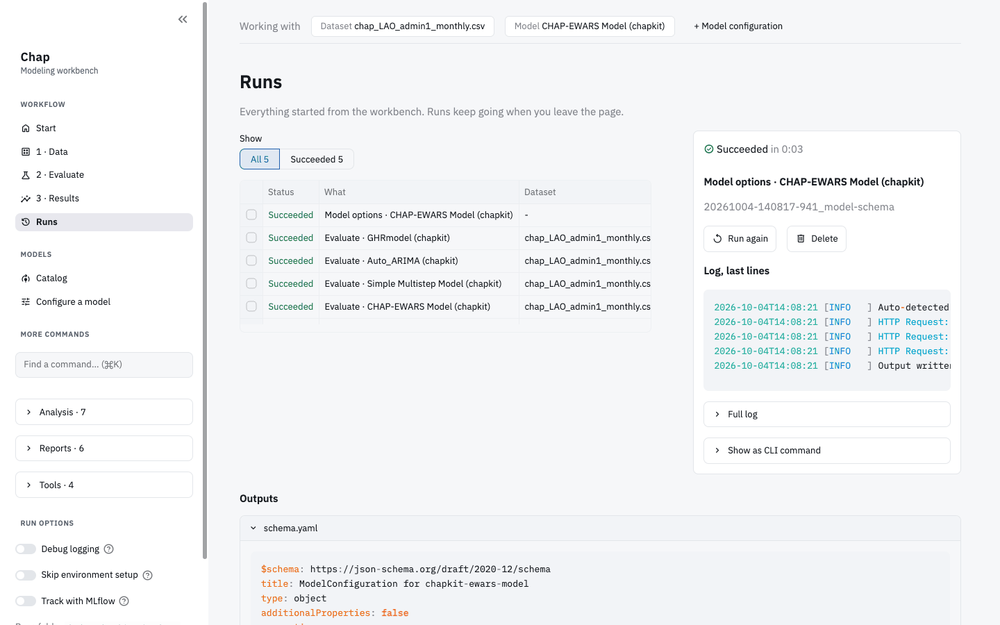

### Other commands

**More commands** in the sidebar lists the remaining `chap` commands, such as reports, model cards, ensembles and counterfactual analysis. Each has a form generated from the command's own options.

## Models and the catalog

The **Catalog** lists the models you can use:

- the chapkit models in the [model marketplace](https://github.com/dhis2-chap/model-marketplace);
- models from a GitHub repository or a folder;
- your own list of models, in `models.yaml` in the runs folder (or a shared list given with `--models`). Every model you run is added to it.

Filter the list by source or period type, or search it. **Use** makes a model the current one, and Evaluate picks it up.

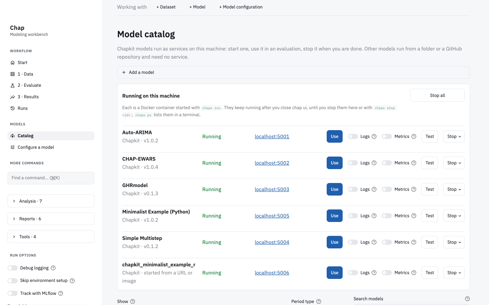

### Running a chapkit model

A chapkit model has to run before it can be evaluated. **Start instance** opens a dialog that says what will happen:

- The model runs as a Docker container on this machine, started with `chaps run <model id>`.
- It answers on `localhost`, on a free port, and only from this machine. **Port and network** sets a port of your own, or lets other machines reach it.
- It keeps running after you close `chap ui`, until you stop it.
- The first start downloads the model's image, which can take a few minutes.

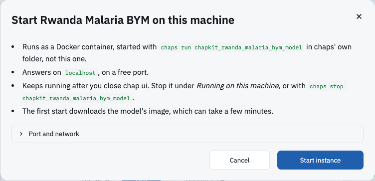

### Running on this machine

Running models are listed at the top of the catalog, with their state and address:

- **Use** selects the running model for an evaluation.
- **Logs** shows its latest log lines.
- **Metrics** shows what the model reports about itself: trainings and predictions since it started, HTTP requests, memory, CPU time and uptime. These come from the model's `/metrics` endpoint, which every chapkit model in the marketplace provides.
- **Test** has the model train and predict on generated data (`chaps models test`).
- **Stop** stops it. **Stop, keep its data** keeps the model's stored configurations and trained models, so starting it again picks up where it left off. **Stop and delete its data** removes those too.

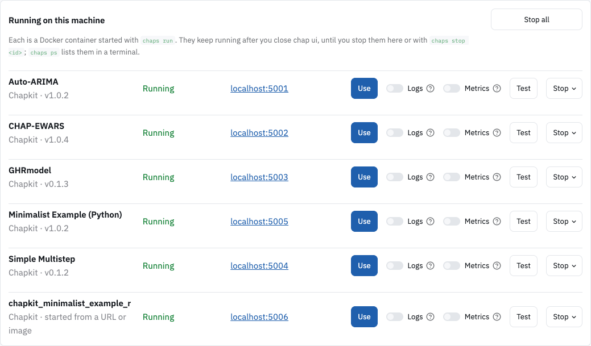

The list is the same as `chaps ps` in a terminal: models started with `chaps run` there show up here, and the other way round. **Stop all** stops the models `chap ui` started and leaves models in other `chaps run` groups alone.

### Models the marketplace does not list

**Add a model** also takes a chapkit model's GitHub repository URL or an image reference, and starts it with `chaps run`. A repository URL runs its newest published build. Starting the same source again reuses the same instance.

### In a chaps deployment

When `chap ui` is started inside a chaps deployment, or given one with `--chaps-project`, models start in that deployment instead.

A deployment that includes chap-core may run its models without a port of their own; they are then reached through chap-core. `chap eval` cannot use a model that way, because chap-core only passes reads through. Such a model is shown as **Only reachable through chap-core**, and **Expose** gives it a port (`chaps models expose`).

### Without chaps

Without chaps, **Start instance** runs the model's image with `docker run`, reachable from this machine only, and **Stop** removes the container. An image built only for amd64 runs under emulation on an arm64 machine, such as a Mac with Apple silicon. Running containers of catalog models that something else started, such as chaps, are listed too, without a Stop button. The catalog shows how to install chaps.

## Where files go

Everything goes in a runs folder, the same one `chap eval` uses: `./runs` in the folder you start `chap ui` from, or the folder `--runs-dir` (or `CHAP_RUNS_DIR`) names. The sidebar shows its path. Nothing is written until you run something, upload a file, save a configuration, or open the Data page, which downloads the first example dataset.

| Path | Contents |
|---|---|
| `runs/<date>-<time>_<command>-<model>/` | One folder per run: its results (such as `evaluation.nc`), `output.log`, and `command.txt` with the equivalent `chap` command |
| `runs/uploads/` | Files added in the browser, and the downloaded example datasets (`--uploads-dir` moves them) |
| `runs/configs/` | Model configurations saved from **Configure a model** |
| `runs/models.yaml` | Your models (`--models` uses another file) |

A chapkit model's own data, its stored configurations and trained models, stays in the model's Docker volume, not in the runs folder.

## Options

| Option | Default | What it does |
|---|---|---|
| `--port` | `8501` | Port the app listens on |
| `--host` | `127.0.0.1` | Address the app listens on. `0.0.0.0` makes it reachable from other machines; the app has no login, so anyone who can reach it can run models |
| `--runs-dir` | `runs` | The runs folder, as above |
| `--uploads-dir` | `uploads/` in the runs folder | Where browser uploads go |
| `--models` | `models.yaml` in the runs folder | Your list of models, for example one shared by a team |
| `--chaps-project` | found automatically | A chaps deployment to use and start models in |
| `--registry-url` | the public marketplace | A marketplace fork or mirror: its base URL or its `registry.yaml`. chaps uses it too |
| `--no-open-browser` | | Do not open a browser on start |

`chap ui --help` lists them as well.
