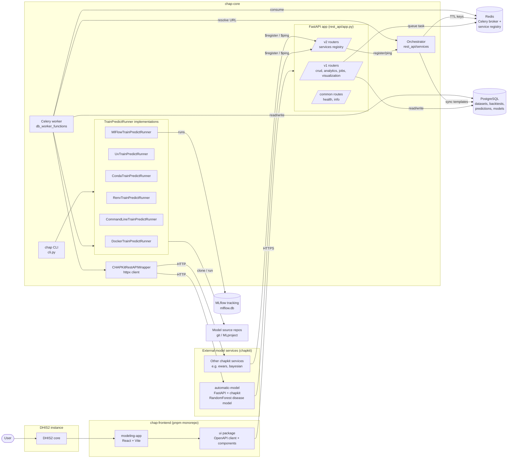
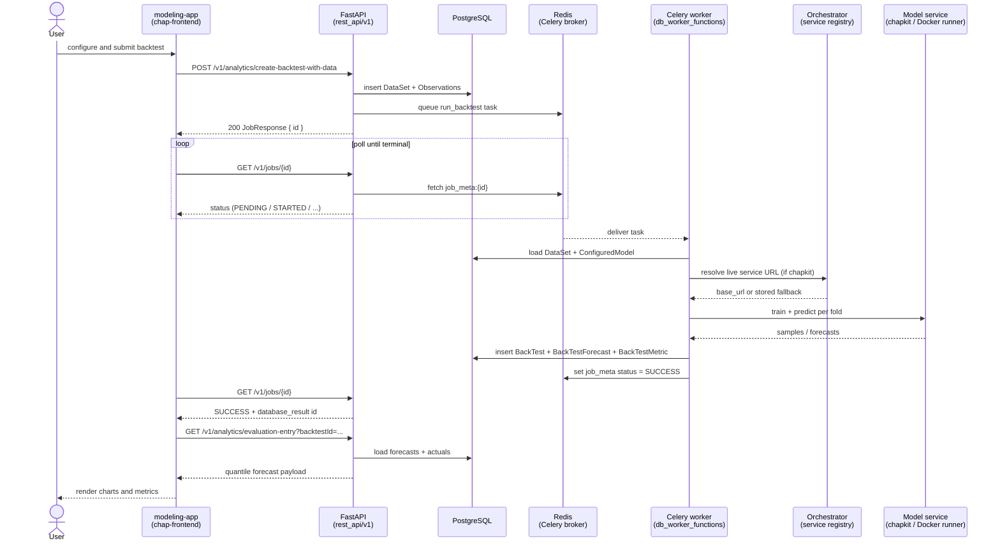
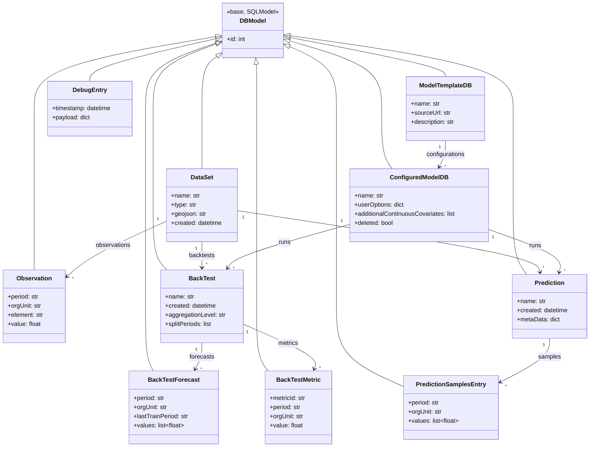

# Architecture diagrams

This page gives a top-level view of the CHAP system across the three main
repositories — `chap-core` (backend), `chap-frontend` (web UI) and
`automatic-model` (an example chapkit model service) — as a set of mermaid
diagrams.

The diagrams complement the more detailed guides:

- [Code overview](code_overview.md)
- [REST API and database architecture](rest_api_and_database.md)
- [Evaluation pipeline](evaluation_pipeline.md)

## Component diagram

Shows the main components across the three repos and how they relate. The
FastAPI server, the Celery worker, Redis and PostgreSQL all live in
`chap-core`. `chap-frontend` is an embedded DHIS2 app that talks to the REST
API through a generated OpenAPI client. Model execution happens either
in-process via a `TrainPredictRunner` (e.g. Docker, MLflow, UV) or remotely
against a chapkit HTTP service such as `automatic-model`.

## Sequence diagram

Representative end-to-end flow for a user-triggered evaluation (backtest)
launched from the modeling app. The same shape applies to predictions
(`/v1/analytics/make-prediction`) — only the worker function and the result
endpoint differ.

## Class diagram

Main domain classes and their relationships as persisted in PostgreSQL.
All tables inherit from `DBModel` (SQLModel + camelCase aliasing). `BackTest`
and `Prediction` are the two "run" concepts — a `BackTest` is a retrospective
evaluation over known data, a `Prediction` is a forward forecast. Both carry
forecast samples and reference the `DataSet` and `ConfiguredModelDB` they were
produced from.

