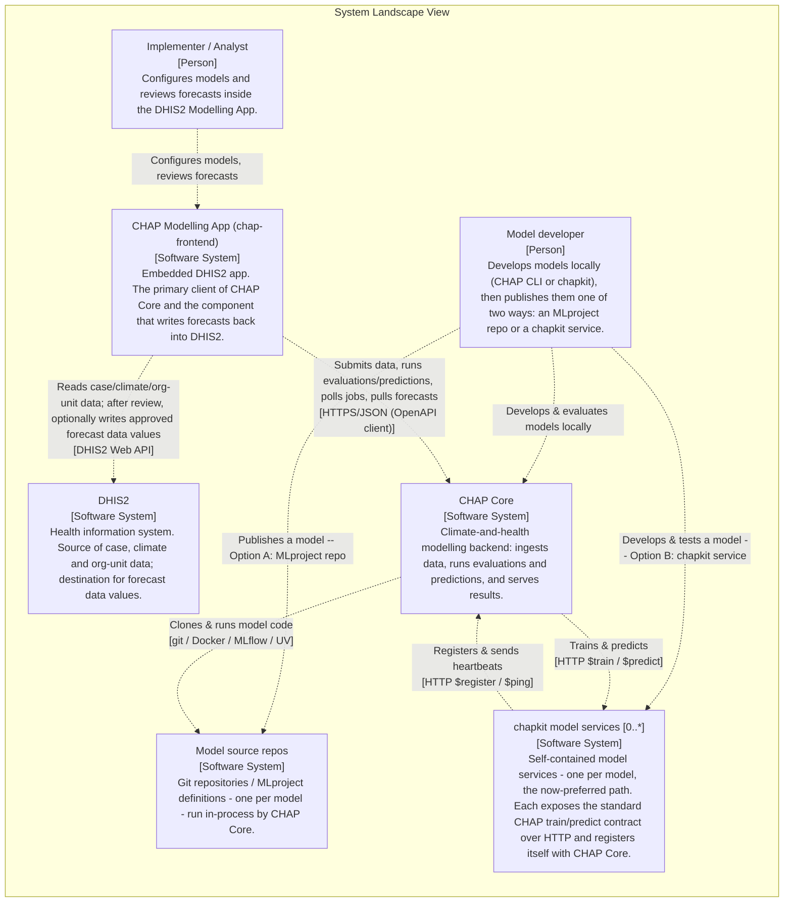
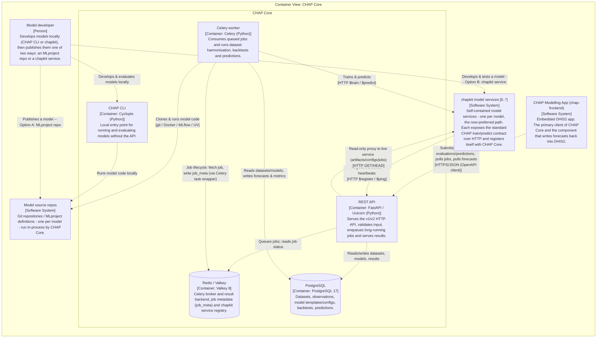
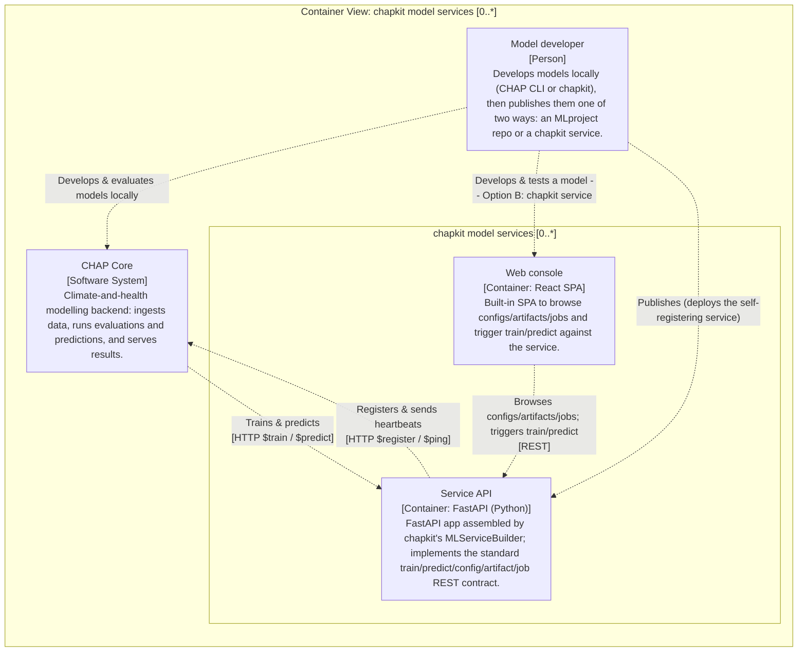
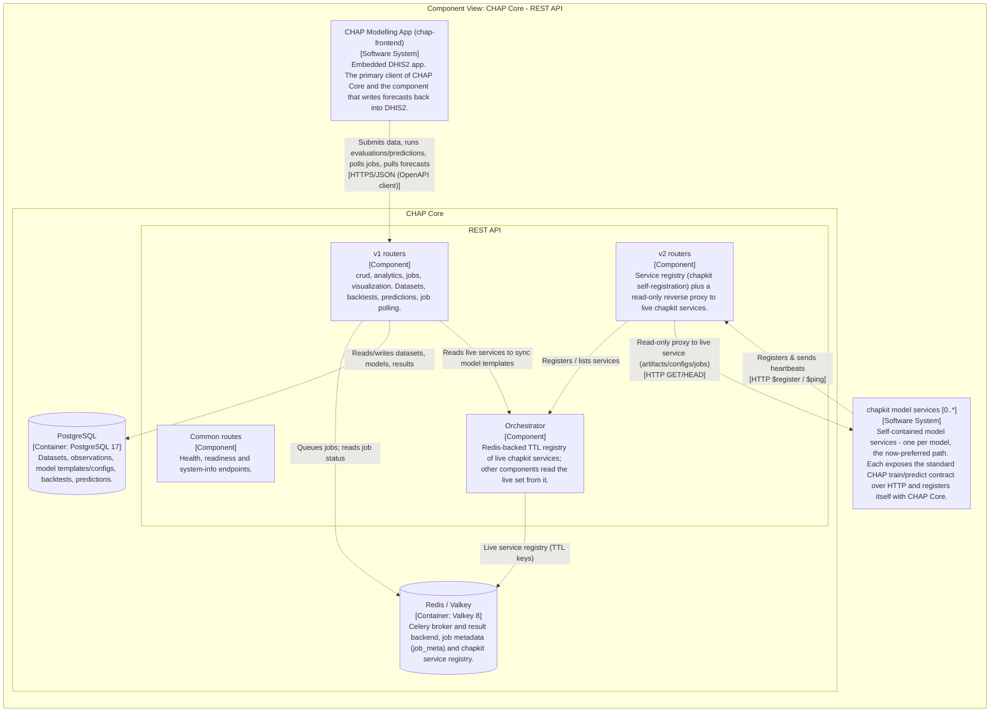
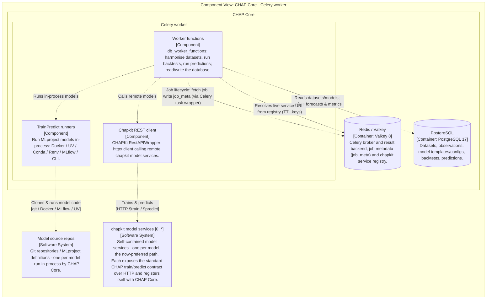
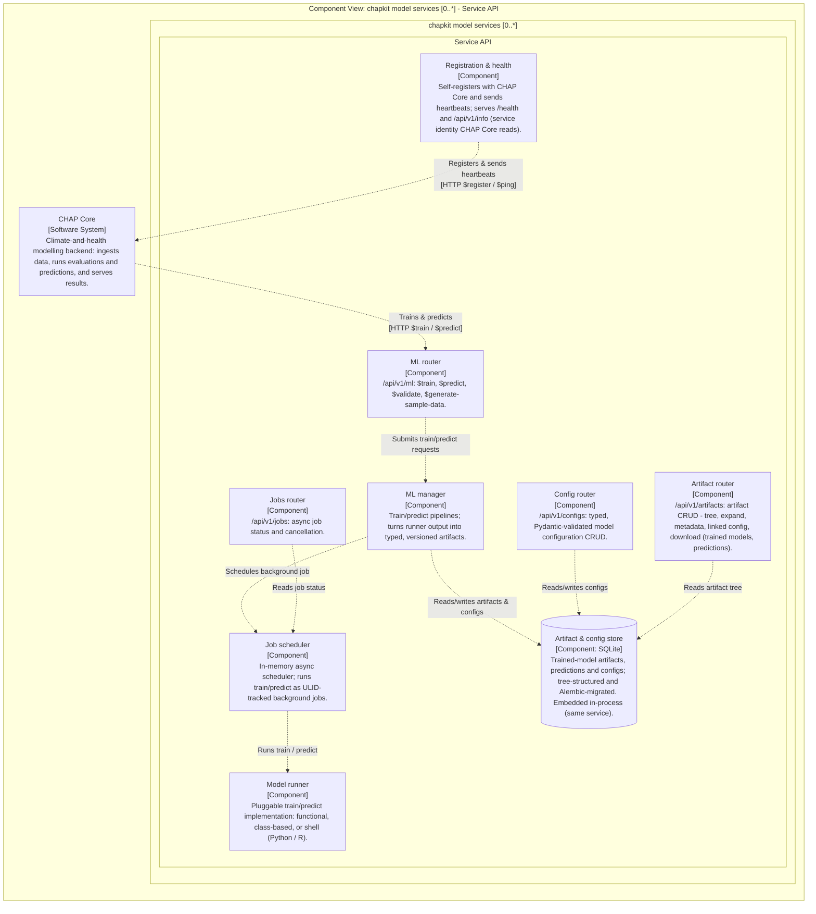
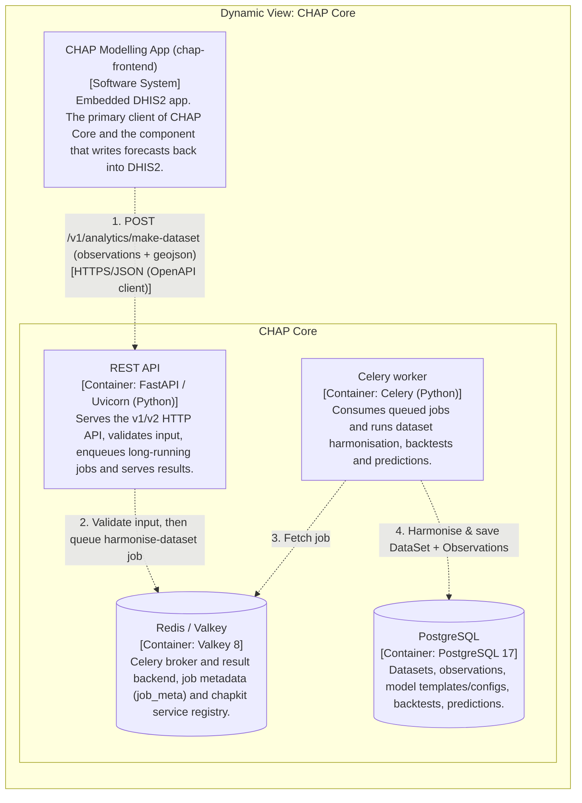
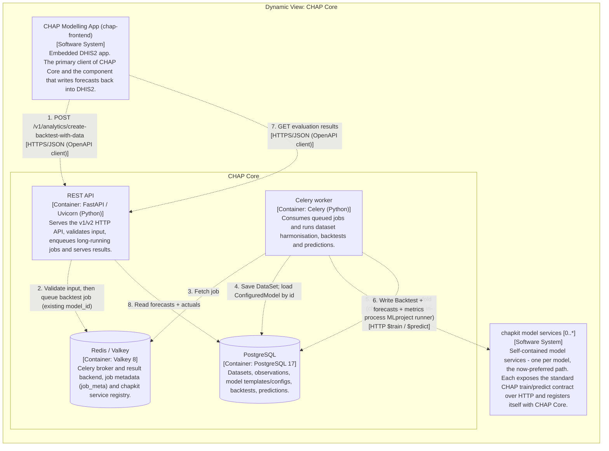
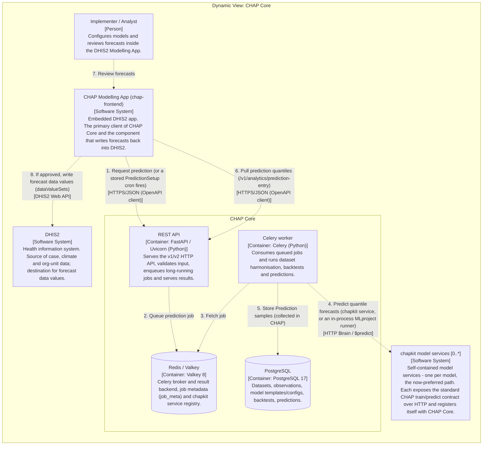

# Architecture model (C4)

<!-- GENERATED by `make architecture-export-docs` from architecture/workspace.dsl. Do not edit by hand. -->

These diagrams are generated from the canonical Structurizr model in
`architecture/workspace.dsl`, so they stay in sync with it. For the
interactive, drill-down viewer and the other renderers, see
`architecture/README.md`.

See also the hand-drawn cross-repo overview in
[Architecture diagrams](architecture_diagrams.md).

## L1 - System landscape

## L2 - Containers: CHAP Core

## L2 - Containers: chapkit model service

## L3 - Components: CHAP Core REST API

## L3 - Components: CHAP Core worker

## L3 - Components: chapkit Service API

## Flow - Ingest a dataset

## Flow - Run a backtest

## Flow - Run a prediction

