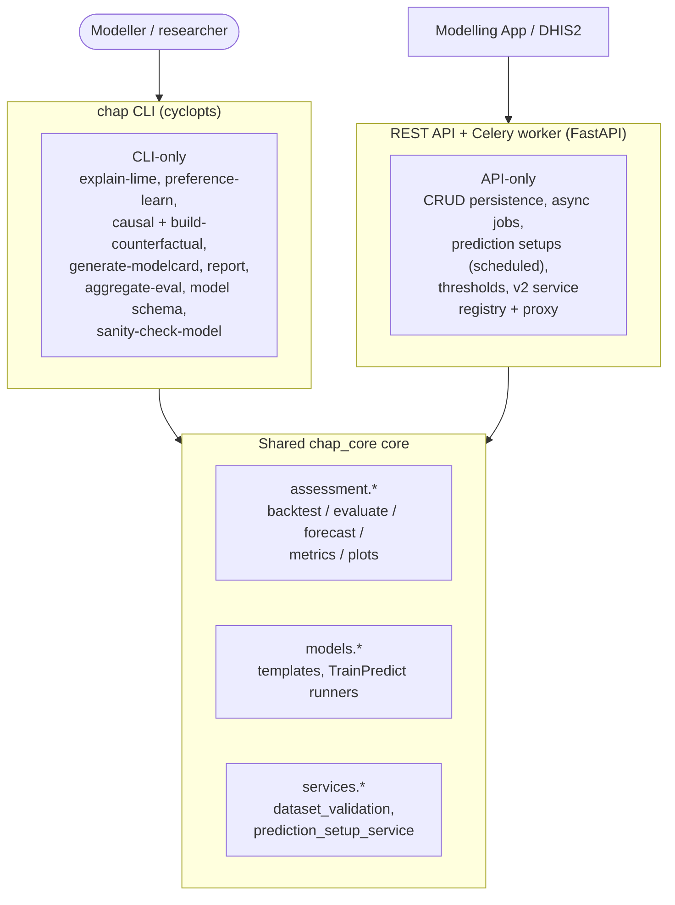

# CLI vs REST API surface

CHAP has two user-facing entry points into the same analytical core: the `chap`
command-line tool and the REST API (with its Celery worker). Both are thin
wrappers over one shared `chap_core` core — `assessment.*`, `models.*` and
`services.*` — but their exposed feature sets only partially overlap. The CLI has
research- and reporting-oriented commands the API does not, and the API has
persistence, async jobs and a model-service registry the CLI does not.

This page makes that split explicit so you can pick the right entry point for a
task and know which capabilities each one offers. For the structural picture see
[Architecture diagrams](architecture_diagrams.md) and
[REST API and database architecture](rest_api_and_database.md).

## Shared core, two entry points

Both entry points call the same core for the capabilities they share (evaluate,
forecast, validate, plot, inspect models); the boxes above the core list what is
unique to each side.

## Capability matrix

Grouped by capability area. A dash (—) means the surface does not expose that
capability today.

| Capability | CLI | REST API | Shared module |
|---|---|---|---|
| Evaluate / backtest | `eval` | `POST /v1/analytics/create-backtest*`, `POST /v1/crud/backtests` | `chap_core.assessment.evaluation`, `rest_api/db_worker_functions.py` |
| Forecast / predict | `forecast`, `multi-forecast` | `POST /v1/analytics/make-prediction`, `.../prediction-setups/{id}/run` | `chap_core.assessment.forecast` |
| Dataset validate | `validate` | validated on `POST /v1/analytics/make-dataset` | `chap_core.services.dataset_validation` |
| Dataset ingest / persist | — | `POST /v1/crud/datasets*`, `make-dataset` | `chap_core.database` (`DataSetManager`) |
| Plots / visualization | `plot-dataset`, `plot-backtest` (file output) | `GET /v1/visualization/*` (Vega specs) | `chap_core.assessment.backtest_plots` |
| Model config / introspection | `model schema`, `sanity-check-model` | `GET /v1/crud/model-templates`, `.../configured-models` | `chap_core.models.model_template` |
| Async job lifecycle | — (runs inline) | `GET/DELETE /v1/jobs/*`, `.../cancel`, `.../logs` | Celery + Redis |
| Prediction setups (scheduled) | — | `/v1/crud/prediction-setups*` | `chap_core.services.prediction_setup_service` |
| Thresholds | — | `GET /v1/analytics/thresholds/strategies`, `POST /v1/analytics/thresholds` | threshold strategy registry |
| Service registry / proxy (v2) | — | `/v2/services*` (register, ping, list, proxy) | orchestrator (`rest_api/services`) |
| Explainability (LIME) | `explain-lime` | — | — |
| Preference learning | `preference-learn` | — | — |
| Causal / counterfactual | `causal`, `build-counterfactual` | — | — |
| Model cards / PDF report | `generate-modelcard`, `report`, `generate-pdf-report` | — | — |
| Hierarchy aggregation | `aggregate-eval` | — | — |

## Reading this

- **CLI-only** commands cluster around research and reporting: explainability,
  preference learning, causal analysis, model cards and PDF/report generation,
  hierarchy aggregation, and schema/self-test introspection. They read and write
  files (CSV, GeoJSON, NetCDF, PNG, PDF, HTML) and run models locally.
- **API-only** endpoints cluster around operating a service: persistent CRUD over
  datasets/backtests/predictions/models, the async job lifecycle, scheduled
  prediction setups, thresholds, and the v2 model-service registry used by the
  Modelling App and external chapkit services.
- **Shared** capabilities (backtest/evaluate, forecast/predict, validate, plot,
  inspect models) run through the same `chap_core` core, so behaviour is
  consistent even though the invocation surface differs.

The source of truth for each surface is `chap_core/cli_endpoints/` (CLI commands)
and `chap_core/rest_api/v1` + `chap_core/rest_api/v2` (API routers); update this
page when those surfaces change.
