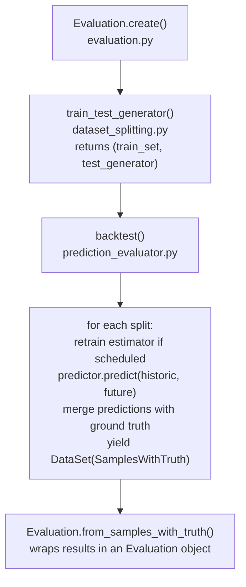

# Evaluation Pipeline

This document explains how model evaluation (backtesting) works internally in Chap, with a focus on the expanding window cross-validation strategy used to split time series data.

## Overview

The evaluation pipeline answers the question: *"How well does a model predict disease cases on data it has not seen?"*

It does this by:

1. Splitting a historical dataset into training and test portions
2. Training the model on the training data
3. Generating predictions for each test window
4. Comparing predictions against observed values (ground truth)

Because disease surveillance data is a time series, we cannot use random train/test splits. Instead, Chap uses **expanding window cross-validation**, where the training data always precedes the test data chronologically.

## Pipeline Architecture

The evaluation flow from entry point to results:



## Expanding Window Cross-Validation

### The Problem

Standard k-fold cross-validation randomly assigns data points to folds. This is invalid for time series because:

- Models would train on future data and predict the past
- Temporal autocorrelation would leak information between folds

### The Strategy

Chap uses an **expanding window** approach where:

- The model is trained at `n_retrain` evenly spaced split points, with `n_retrain=1` training once at the beginning
- Split 0 trains on the dedicated initial training set; later retrains use the expanding historic window available at that split
- Multiple test windows are created by sliding forward through the data
- For each test window, the model receives all historical data up to that point

The key parameters are:

- **prediction_length**: how many periods each test window covers
- **n_test_sets**: how many test windows to create
- **stride**: how many periods to advance between windows
- **n_retrain**: how many times to retrain the model, evenly spaced across the test splits

### How Split Indices Are Calculated

The `train_test_generator` function computes splits from the end of the dataset working backwards:

```
split_idx = -(prediction_length + (n_test_sets - 1) * stride + 1)
```

This ensures the last test window ends at the final period of the dataset.

### Concrete Example

Consider a dataset with 20 monthly periods (indices 0-19), `prediction_length=3`, `n_test_sets=3`, `stride=1`:

```
split_idx = -(3 + (3 - 1) * 1 + 1) = -6  -> index 14

Split 0: historic = [0..14],  future = [15, 16, 17]
Split 1: historic = [0..15],  future = [16, 17, 18]
Split 2: historic = [0..16],  future = [17, 18, 19]

Train set = [0..14]  (same periods as split 0 historic data, but kept as the dedicated training set)
```

Visually, with `T` = train, `H` = extra historic context, `F` = future/test:

```
Period:   0  1  2  3  4  5  6  7  8  9 10 11 12 13 14 15 16 17 18 19

Train:    T  T  T  T  T  T  T  T  T  T  T  T  T  T  T
Split 0:  T  T  T  T  T  T  T  T  T  T  T  T  T  T  T  F  F  F
Split 1:  T  T  T  T  T  T  T  T  T  T  T  T  T  T  T  H  F  F  F
Split 2:  T  T  T  T  T  T  T  T  T  T  T  T  T  T  T  H  H  F  F  F
```

Note how the historic data expands with each split while the future window slides forward. At split 0, `backtest()` trains on the dedicated `train_set`; any later retrains use the expanding historic data for that split.

### What the Model Sees

For each test split, the predictor receives:

- **historic_data**: full dataset (all features including disease_cases) up to the split point
- **future_data (masked)**: future covariates (e.g. climate data) *without* disease_cases -- this is what the model uses to make predictions
- **future_data (truth)**: full future data including disease_cases -- used after prediction to evaluate accuracy

## Key Components

### `chap_core/assessment/dataset_splitting.py`

Handles splitting datasets into train/test portions:

- `train_test_generator()` -- main function implementing expanding window splits
- `train_test_split()` -- single split at one time point
- `split_test_train_on_period()` -- generates splits at multiple split points
- `get_split_points_for_data_set()` -- computes evenly-spaced split points

### `chap_core/assessment/prediction_evaluator.py`

Runs the model and collects predictions:

- `backtest()` -- trains or retrains the model at `n_retrain` evenly spaced split points and yields predictions for each split
- `evaluate_model()` -- full evaluation with GluonTS metrics and PDF report

### `chap_core/assessment/evaluation.py`

High-level evaluation abstraction:

- `Evaluation.create()` -- end-to-end factory: runs backtest and wraps results
- `Evaluation.from_samples_with_truth()` -- builds evaluation from raw prediction results
- `Evaluation.to_file()` / `from_file()` -- NetCDF serialization for sharing results

## Code Flow: `Evaluation.create()`

Step-by-step walkthrough of what happens when `Evaluation.create()` is called (e.g. from the CLI `chap eval` command):

1. **`train_test_generator()`** computes the split index and creates:
     - A dedicated training set (data up to the first split point)
     - An iterator of (historic, masked_future, future_truth) tuples
2. **`backtest()`** is called with the estimator, training set, test generator, number of test sets, and `n_retrain`
3. At split 0, the estimator is **trained on the dedicated training set**. At later retrain points, it is trained on that split's expanding historic window
4. For each test split, the most recently trained predictor generates samples and they are **merged with ground truth** into `SamplesWithTruth` objects
5. The last training period used as evaluation metadata is taken from the initial training set
6. **`from_samples_with_truth()`** assembles an `Evaluation` object containing:
     - `Backtest` with all forecasts and observations
     - Historical observations for plotting context
7. The `Evaluation` can then be **exported** to NetCDF, used for metric computation, or visualized