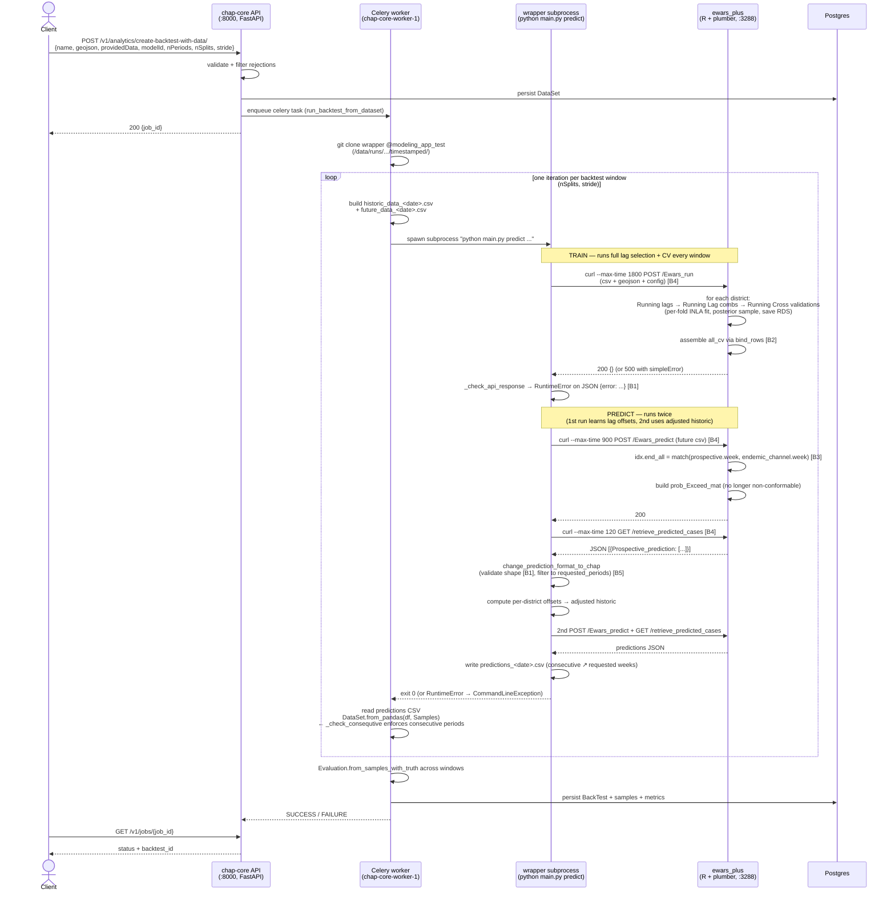

# `ewars_plus` backtest call flow

End-to-end map of what happens when a client submits
`POST /v1/analytics/create-backtest-with-data/` with `modelId: ewars_plus`.

The diagram traces the request through five components that live in
different processes (and three different repos):

| Component | Repo | Process |
|---|---|---|
| chap-core API | `dhis2-chap/chap-core` | FastAPI in `chap` container |
| Celery worker | `dhis2-chap/chap-core` | `chap-core-worker-1` container |
| Wrapper subprocess | `dhis2-chap/ewars_plus_python_wrapper` | `python main.py predict ...` spawned per backtest window inside the worker container |
| ewars_plus API | published only as `maquins/ewars_plus_api:Upload`; the chap patch lives in `external_models/ewars_plus_api_patch/` here | R + plumber in `ewars_plus` container |
| Postgres | infra | `chap-core-postgres-1` container |

## Bug-site legend

These are the five places we've patched (or are patching) in the pipeline.
Numbers refer to the `[Bn]` annotations in the diagram above.

| Tag | Layer | Symptom | Fix | Status |
|---|---|---|---|---|
| **B1** | wrapper response handling | `AttributeError: 'str' object has no attribute 'get'` on opaque error bodies | `_check_api_response` + JSON-shape validation in `change_prediction_format_to_chap` | merged ([CLIM-614](https://dhis2.atlassian.net/browse/CLIM-614)) |
| **B2** | R, `Lag_Model_selection_ewars_By_District_api.R` | `<simpleError in get_preds(aa): names do not match previous names>` when per-year lag selection picks differently-named columns | `dplyr::bind_rows(lapply(...))` instead of `foreach(.combine = rbind)` | chap-core PR [#315](https://github.com/dhis2-chap/chap-core/pull/315) ([CLIM-617](https://dhis2.atlassian.net/browse/CLIM-617)) |
| **B3** | R, `DBII_predictions_Vectorized_API.R` | `<simpleError ... non-conformable arrays>` when prospective weeks fall outside the endemic-channel table | `match(prospective.week, endemic.week)` instead of `foreach(.combine = c) %do% which(...)` | chap-core PR [#315](https://github.com/dhis2-chap/chap-core/pull/315) ([CLIM-617](https://dhis2.atlassian.net/browse/CLIM-617)) |
| **B4** | wrapper, every curl call | task hangs forever when the R server stalls (R at 0% CPU, no log progress) | `curl --max-time {1800,900,120}` per endpoint | merged ([CLIM-618](https://dhis2.atlassian.net/browse/CLIM-618)) |
| **B5** | wrapper, `change_prediction_format_to_chap` | gappy predictions (e.g. `2024W20, W24, W26`) trigger chap-core `Periods must be consecutive` | optional `requested_periods` arg restricting output to the (year, week) tuples actually requested by `future_data` | wrapper PR [#5](https://github.com/dhis2-chap/ewars_plus_python_wrapper/pull/5) ([CLIM-617](https://dhis2.atlassian.net/browse/CLIM-617)) |

## Load-bearing facts the diagram makes obvious

- **One full CV runs per backtest window.** The wrapper calls `train()` at
  the top of every `predict` invocation, and `train()` re-runs lag selection
  + cross-validation from scratch. There is no caching layer between
  windows; ten splits = ten × ~6 min CV.
- **Each `predict` does two `/Ewars_predict` calls.** The first call solves
  for the per-district lag offset, the second produces the actual forecast
  on adjusted historic data.
- **Three layers can fail a request**: the curl/HTTP layer, the R server,
  and chap-core's parser. After the patches above, the failure modes are
  all surfaced as `RuntimeError` / `ModelFailedException` with diagnosable
  messages — no silent hangs and no opaque `AttributeError`s.
- **Lag selection is at train time, not predict time.** `/Ewars_predict`
  consumes the RDS files written during `/Ewars_run` and does no further
  lag selection. Different windows can therefore pick different optimal
  lags from each other (that is what made the per-year `LAG12 / LAG10 /
  LAG7` collision in the original CLIM-617 failure possible).

## Origin of the test data

`/Users/knutdr/Downloads/EWARS.json` (the Malawi 1-district payload used
throughout this investigation): single org-unit `A2Kgu7zMgJr`
("Phalombe-DHO"), 114 weekly periods 2022W44 → 2025W1, four feature
streams (`disease_cases`, `rainfall`, `mean_temperature`, `population`).
Multi-district payloads exercise spatial pooling that is degenerate on
n=1; the 1-district case is fine for end-to-end smoke testing of the
pipeline but not for evaluation quality.
