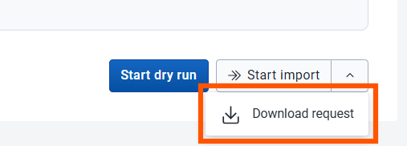

# Run models in Chap with data from DHIS2 / Modeling App

This short guide describes how to import climate and environmental data, configure a model in the DHIS2 Modelling App, and extract the modelling payload.

### 1. Import data using the Climate App

Use the Climate App to import climate and environmental indicators at the **same organisational level and period type** (weekly or monthly) as your disease data. Indicators of interest include air temperature, CHIRPS precipitation (or ERA5-Land precipitation if you know this performs better), relative humidity, NDVI (vegetation), and urban/built-up areas. You may also include other disease-relevant indicators such as soil moisture, surface water, land surface temperature, or elevation. Ensure all imported data are available as data elements.

### 2. Run analytics

After importing the data, run analytics in DHIS2.

### 3. Open the Modelling App

Open the Modelling App and confirm you are using version **4.0.0** or later.

### 4. Create a model

Go to Models, click New model, and select **CHAP-EWARS Model**. This model supports additional covariates. Give the model a clear name such as `extract_data`. Leave n_lags, precision, and regional seasonal settings unchanged.

### 5. Add covariates

Add all covariates you imported via the Climate App by typing their names and using underscores instead of spaces (for example `NDVI` or `relative_humidity`). Save the model when finished.

### 6. Open "New evaluation" form

Go to "Overview" and click "New evaluation. Select the period type, date range, organisation units, and the model you just created. Open "Dataset Configuration" and map each covariate to its corresponding data element you just imported data to. Save the configuration.

### 7. Run a dry run

Click "Start dry run" to verify that the data and configuration are accepted. Continue only if the dry run succeeds.

### 8. Download the payload

Click **Download request** to save the modelling payload to your computer as JSON-file.



## Converting a Modeling App request to CSV and GeoJSON

If you have a JSON request payload from the DHIS2 Modeling App (the `create-backtest-with-data` format), you can convert it directly to a Chap-compatible CSV and GeoJSON file pair using `chap convert-request`:

```bash
chap convert-request example_data/create-backtest-with-data.json /tmp/chap_convert_doctest
```

This reads the JSON file and produces two files:

- `/tmp/chap_convert_doctest.csv` -- a pivoted CSV with `time_period`, `location`, and feature columns
- `/tmp/chap_convert_doctest.geojson` -- the region boundaries extracted from the request


<div style="margin-bottom: 10rem;" markdown>

Next: [Validate your data](index.md#3-validating-your-data)

</div>
