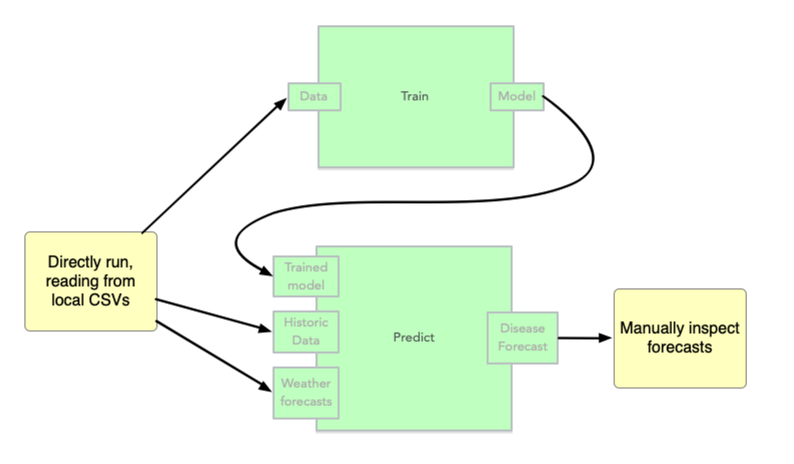
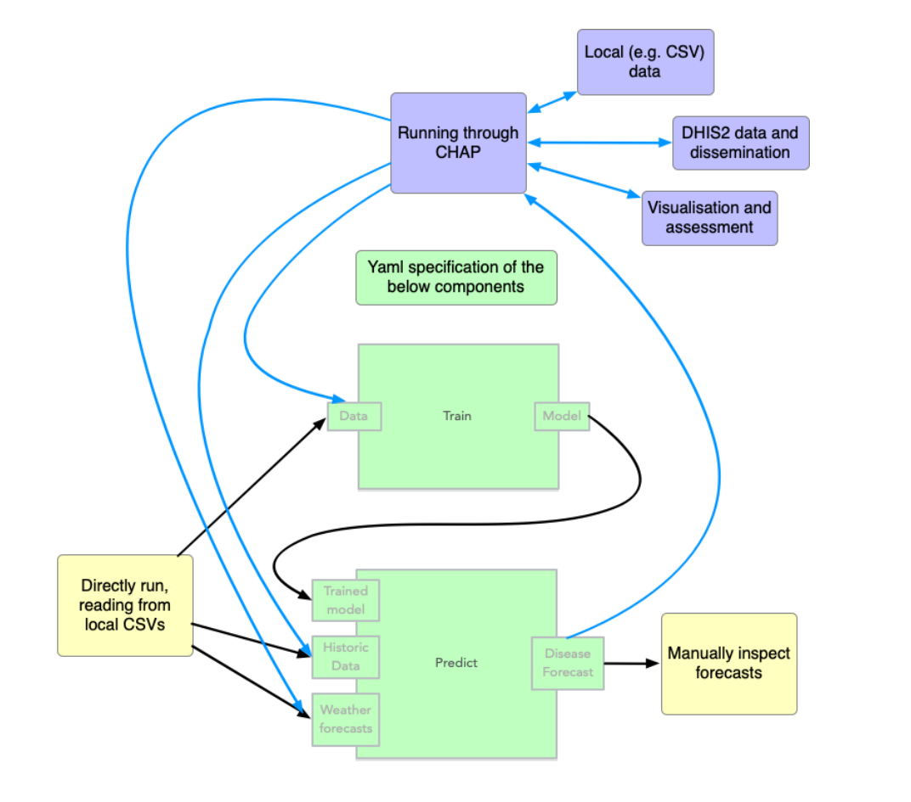

# Making chap-compatible train and predict endpoints

To integrate a component for standardized, interoperable use, it must follow an established standard. Chap defines one such standard, and by adhering to it, your code gains all the benefits of seamless platform integration. In predictive modeling and machine learning, it is a long-established best practice to provide separate functions for training and prediction.

The following figure shows the basic overview of how Chap expects modelling code to be, i.e. divided into separated _train_ and _predict_ parts

The figure below shows how the chap platform orchestrates training and prediction of your model using the same endpoints as above:

The exact way of specifying the train and predict endpoints are described [here](describe_model.md).

