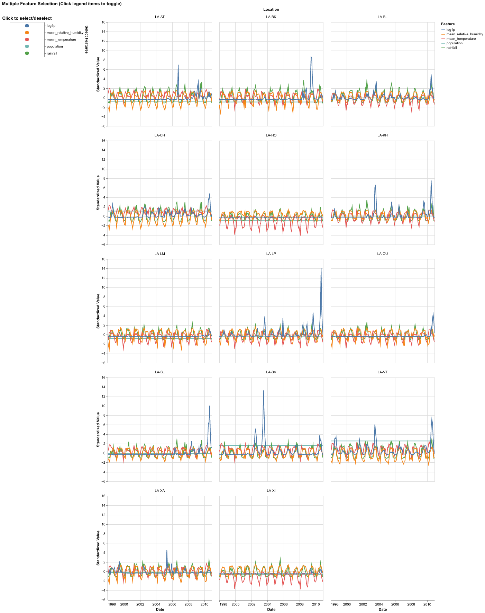
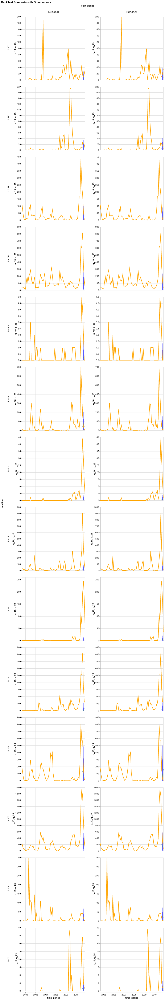
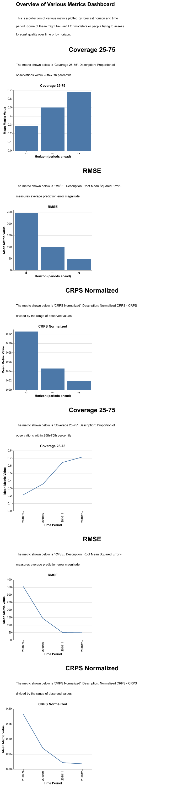
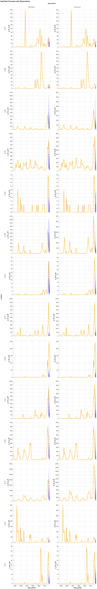

# Monday Afternoon - 23 Feb

See the [Evaluation Walkthrough](../../contributor/evaluation_walkthrough.md) for a
hands-on, step-by-step guide through the evaluation pipeline.

## Workshop: Evaluating Models on the Laos Dengue Dataset

In this hands-on exercise you will download a real dataset, run two different models through the CHAP evaluation pipeline, and compare the results.

### 1. Download the dataset

Create a working directory and download the Laos dengue dataset (monthly, admin-1 level):

```console
$ mkdir laos-workshop && cd laos-workshop
$ curl -sL -o chap_LAO_admin1_monthly.csv \
    "https://raw.githubusercontent.com/dhis2/climate-health-data/main/lao/chap_LAO_admin1_monthly.csv"
$ curl -sL -o LAO_ADM1.geojson \
    "https://raw.githubusercontent.com/dhis2/climate-health-data/main/lao/LAO_ADM1.geojson"
```

The CSV contains ~2800 rows covering 18 provinces from 1998-2010 with columns: `time_period`, `location`, `disease_cases`, `population`, `location_name`, `rainfall`, `mean_temperature`, `mean_relative_humidity`.

### 2. Prepare the GeoJSON

The `chap eval` command auto-discovers a GeoJSON file when it shares the same base name as the CSV. The GeoJSON also needs an `id` property matching the ISO location codes used in the CSV.

Rename the file and add the required `id` fields:

```console
$ mv LAO_ADM1.geojson chap_LAO_admin1_monthly.geojson
$ python -c "
import json
with open('chap_LAO_admin1_monthly.geojson') as f:
    data = json.load(f)
for feature in data['features']:
    feature['id'] = feature['properties']['shapeISO']
    feature['properties']['id'] = feature['properties']['shapeISO']
with open('chap_LAO_admin1_monthly.geojson', 'w') as f:
    json.dump(data, f)
print('Done - added id from shapeISO')
"
```

### 3. Clean the data

Some provinces have missing disease case data. Remove them so the models can run cleanly:

```console
$ python -c "
import pandas as pd, json
df = pd.read_csv('chap_LAO_admin1_monthly.csv')
bad = df.groupby('location')['disease_cases'].apply(lambda x: x.isna().any())
bad_locs = bad[bad].index.tolist()
print(f'Removing {len(bad_locs)} locations with missing data: {bad_locs}')
df[~df['location'].isin(bad_locs)].to_csv('chap_LAO_admin1_monthly.csv', index=False)
with open('chap_LAO_admin1_monthly.geojson') as f:
    geo = json.load(f)
geo['features'] = [ft for ft in geo['features'] if ft['id'] not in bad_locs]
with open('chap_LAO_admin1_monthly.geojson', 'w') as f:
    json.dump(geo, f)
print(f'Dataset now has {df[\"location\"].nunique() - len(bad_locs)} locations')
"
```

### 4. Explore the dataset

```console
$ chap plot-dataset chap_LAO_admin1_monthly.csv
```

This opens an interactive plot in your browser showing standardized disease cases and climate features across all locations:



### 5. Evaluate Model A -- Naive baseline

Run a backtest with 2 train/test splits and a 3-month forecast horizon using the built-in naive model:

```console
$ chap eval external_models/naive_python_model_uv \
    chap_LAO_admin1_monthly.csv \
    naive_eval.nc \
    --backtest-params.n-splits 2 \
    --backtest-params.n-periods 3
```

Generate the evaluation plots:

```console
$ chap plot-backtest naive_eval.nc naive_evaluation_plot.png --plot-type evaluation_plot
$ chap plot-backtest naive_eval.nc naive_metrics_dashboard.png --plot-type metrics_dashboard
```

**Evaluation plot** -- observed vs. predicted cases per location and split:



**Metrics dashboard** -- summary metrics across locations:



### 6. Evaluate Model B -- Auto-EWARS

Now evaluate a more sophisticated model. The EWARS model is fetched directly from GitHub:

```console
$ chap eval https://github.com/dhis2-chap/chap_auto_ewars \
    chap_LAO_admin1_monthly.csv \
    ewars_eval.nc \
    --backtest-params.n-splits 2 \
    --backtest-params.n-periods 3
```

Generate the same plots:

```console
$ chap plot-backtest ewars_eval.nc ewars_evaluation_plot.png --plot-type evaluation_plot
$ chap plot-backtest ewars_eval.nc ewars_metrics_dashboard.png --plot-type metrics_dashboard
```

**Evaluation plot:**



**Metrics dashboard:**


### 7. Compare models

Export aggregate metrics from both evaluations into a single CSV:

```console
$ chap export-metrics \
    --input-files naive_eval.nc \
    --input-files ewars_eval.nc \
    --output-file metrics_comparison.csv
```

The output CSV contains one row per model with columns for each metric:

| model | mae | rmse | crps | coverage_10_90 |
|---|---|---|---|---|
| naive_python_model_uv | 131.5 | 275.5 | 109.6 | 0.607 |
| chap_auto_ewars | 98.3 | 197.8 | 73.3 | 0.726 |

Lower MAE, RMSE, and CRPS indicate better accuracy. Coverage_10_90 measures how often the true value falls within the 10th-90th percentile prediction interval (ideal: 0.80).

In this comparison, the EWARS model outperforms the naive baseline across all metrics.
