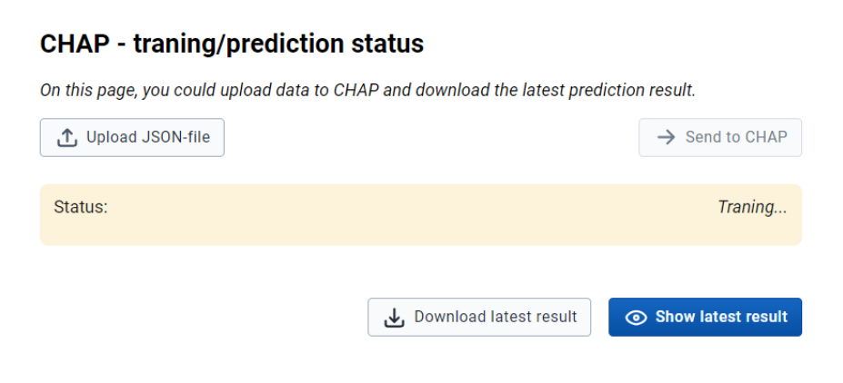
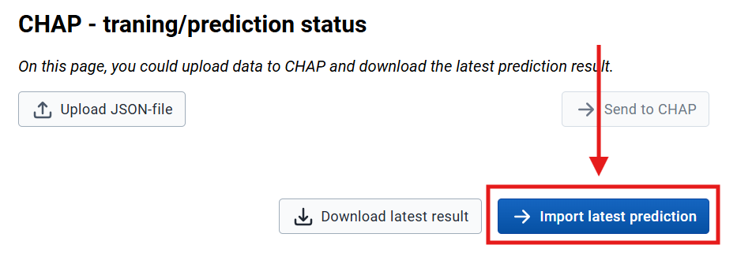
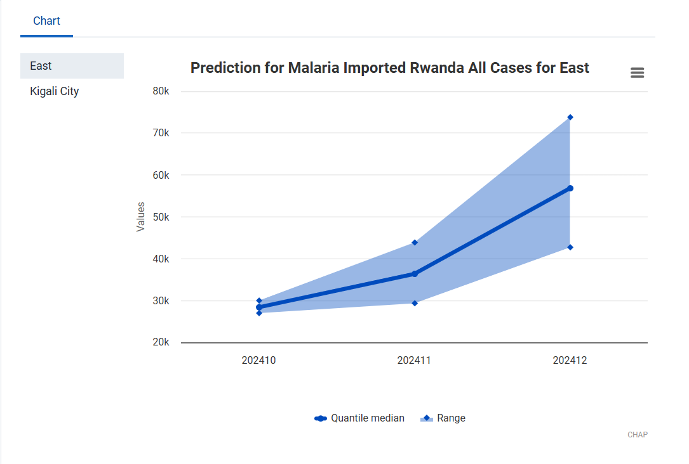
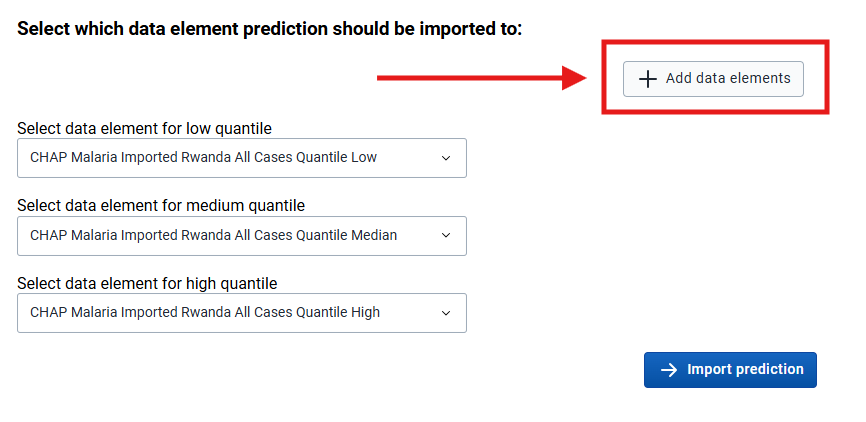
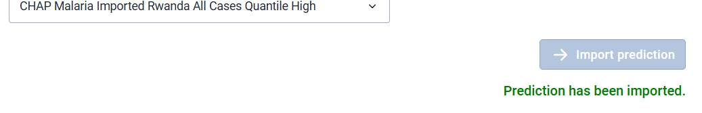
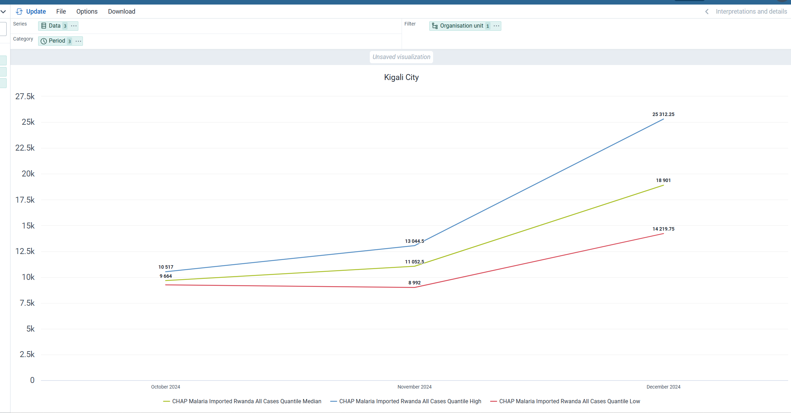

# How to use Modeling App

# This page is not in use at the momement, needs to be updated to Modeling App

**This page contains documentation on how to use the Modeling App to create predictions.**

**NOTE: The old name for this app was _Modeling App_. We are currently updating the documentation
to reflect the new name. Some references may still be in transition.**

Modeling App enables integration between [CHAP Core](https://github.com/dhis2-chap/chap-core) and [DHIS2](https://dhis2.org/) (2.41+).

---

## 1 Selecting prediction data

**Find the Modeling App in your DHIS2 instance and open it**

- You can ignore the warning about "Missing Route"
- You need to have the population registered for a minimum of one DHIS2 year period or one DHIS2 month period for each org unit in the selected training period.
- Select only periods of the same type as the model supports. For example, "EWARS - monthly data" would only accept monthly data.
- Ensure you have a DHIS2 data element for the disease data you want to make a prediction for.
- You select which areas you want to create a prediction for in the "Select organization units" section.
- "period" in the form refers to the model's training period; the prediction will be for three months. For instance, if you select all periods between January 2013 and August 2024, a prediction will be made for September 2024, October 2024, and November 2024.  
   

**Important about selecting period**  
If your primary goal is to predict the number of cases (rather than to evaluate models), make sure you select the most recent completed period up to today. CHAP Core does not account for specific dates and treats each month's registrations equally. Therefore, it is crucial to ensure that the data you provide is complete. For example, if today's date is the 15th, the data for the current month is likely to be incomplete because it won't include information from the second half of the month. CHAP Core is not able to tell that the data belongs to an incomplete month and will count it as one full month of registration when it in reality is only 15 days. This will cause inaccurate predictions.

Below is an example of how a filled form could look like:  
 

Click **"Send data to CHAP ➔"** to use the Modeling App to transfer data directly to CHAP Core's REST-API.

> &#x1F6C8; At this point, it's also possible to click **"Download data"** to download the specified disease data from DHIS2 into a CHAP Core-supported format, and continue the remaining analysis [programmatically with the CHAP-cli](../chap-cli/using-pa-with-cli).

---

## 2 Status for predictions and prediction import

After you have clicked **"Send data to CHAP ➔"**, you will be redirected to the "CHAP Core status" page. On this page, the status of the prediction will be shown. See the image below.

When the information about the status disappears (as shown below), the prediction is completed. Click **"Import latest prediction"** to see the result.

---

## 3 Import prediction page

You will then be redirected to the "Import prediction" page, where you can import the prediction into DHIS2. At the top, you will see a chart, as shown below, describing what you are about to import.

### Add data elements

If you have not yet created a data element to store CHAP predictions, you need to click "Add data elements" and follow the given instructions.

### Import prediction

After you have selected the data elements, click on "Import prediction."

---

## 4 Visualize

Finally, you have imported the prediction into DHIS2. You can now visualize the prediction in the Data Visualizer App. If you want the visualization immediately, you need to export analytic tables in the "Data Administrator" app first.

 
 

