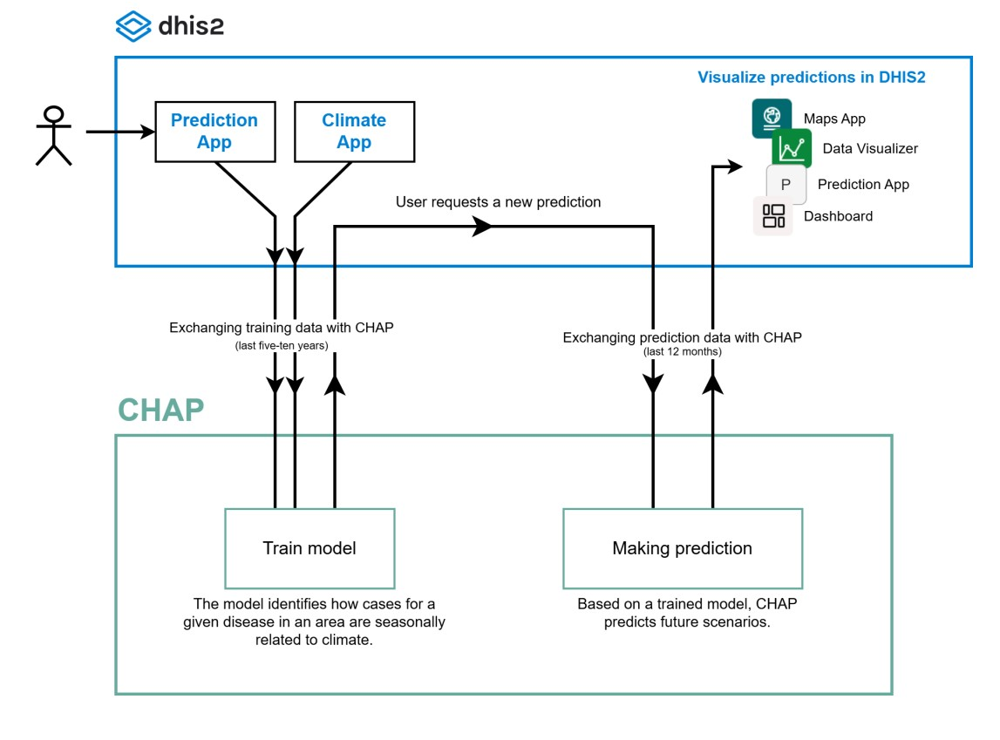

Integrating external models with DHIS2 through CHAP
====================================================

Assuming you have CHAP running on a server with DHIS2 (:doc:`see this guide <running-chap-on-server>`), it is possible to 
make new external models available. 
Currently, CHAP has an internal registry of models that can be used.
If you want to run a model that is not in the registry, this now has to be done by editing the local CHAP code at the server,
but we are working on making this more flexible. For now, please reach out if you want a new model to be added to the internal registry
in a given installation.

The following figure shows how the train and predict entrypoints are part of a data flow between DHIS2 and the external model:

