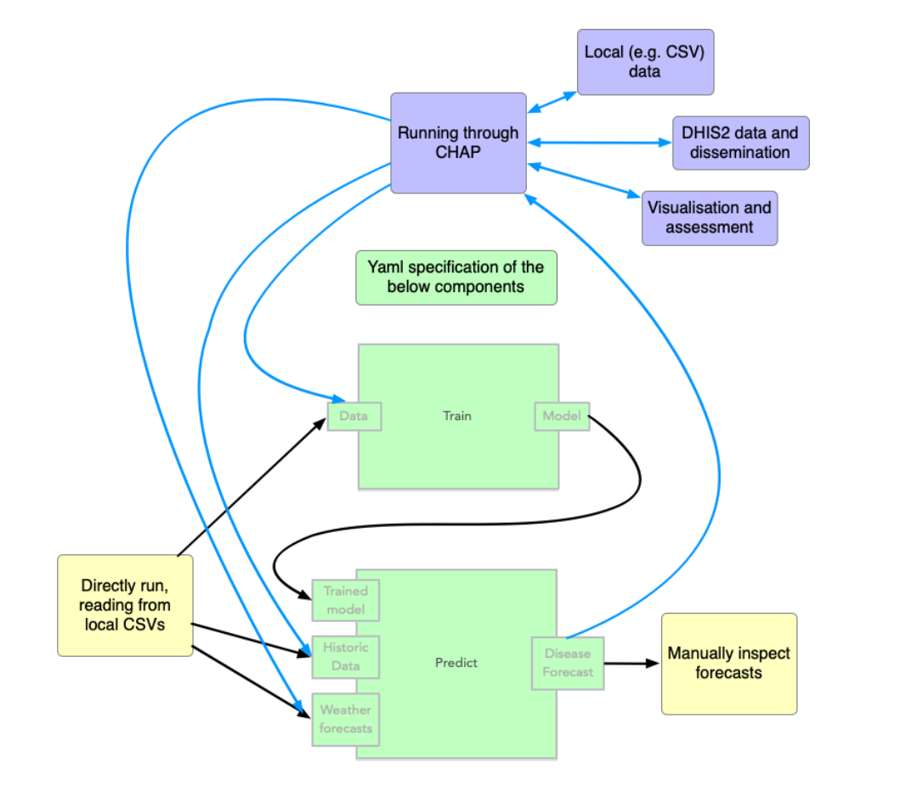

.. _external_models_overview:

Making existing models compatible with CHAP
--------------------------------------------

The benefit of running your model through CHAP is that you can let CHAP handle all the data processing and evaluation, and you can easily compare your 
model to other models. To do this, you need to create an MLProject configuration file for your model. This file should specify the entry points for training and predicting, as well as any dependencies your model has. You can then run your model through CHAP using the CHAP CLI. If you use the `template reposity <https://github.com/dhis2-chap/chap_model_template>`_ this file will already be included, and should function immediately upon installation.

You can also see an example of such a file in the `minimalist example <https://github.com/dhis2-chap/minimalist_example>`_

This figure shows the basic overview of how CHAP expects modelling code to be, i.e. divided into separated *train* and *predict* parts.

.. image:: modelling_code.png
   :alt: External model structure
   :width: 600px
   :align: center

To make code compatible with CHAP, the code needs to contain seperate entry points for train and predict, which 
should be command line commands. This is defined through a MLproject project file. 

See :ref:`external_model_specification` for details on how to specify this file to make a model compatible with CHAP.

The following illustrates how CHAP interacts with an external model:

