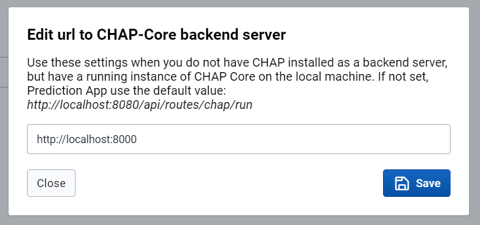

# Setting up CHAP Prediction App in DHIS2

## Requirements:

- Access to credentials for Google Earth Engine. (Google Service Account Email and Private Key)
    - TODO: Add note that this is only needed for some use cases...
    - TODO: Write more on where to input these credentials...

## 1 Setting up CHAP-Core REST API

1. The Prediction App requires communication with an instance of the CHAP-Core REST-API. For using the Prediction App in a production environment, it's recommended that the Chap REST-API has been set up on a permanent server by a system admin. See more about how to do so [here](#../installation/running-chap-on-server.md). 

    > &#x1F6C8; Alternatively, you can follow [the instructions on how to setup a Chap REST-API locally using Docker](../installation/docker-compose-doc.md). 

2. Verify that you have access to the CHAP REST-API and that it's running correctly, by visiting `<your-url-to-chap-server>/docs`. A Swagger page (REST-API documentation) should display. 

    > &#x1F6C8; If you're running the REST-API as a local Docker container, verify by going to `http://localhost:8000/docs`.

## 2 Download and Install Prediction App

Currently the Prediction App is not yet available on the DHIS2 App Hub. 
Until then you need to download the Prediction App as a ZIP file for installing it on your DHIS2 instance.

1. Download Prediction App from [https://github.com/dhis2/prediction-app/raw/refs/heads/main/build/bundle/prediction-app-1.0.0.zip](https://github.com/dhis2/prediction-app/raw/refs/heads/main/build/bundle/prediction-app-1.0.0.zip)

2. Upload the ZIP file (Prediction App) to your DHIS2 instance ([Learn how to install a custom DHIS2 app](https://dhis2-app-course.ifi.uio.no/learn/dhis2/app-development-guides/build-publish-app-platform-app/manual-install/))

> &#x1F6C8; Alternatively for developers, you can run a local development version of the Prediction App [as described here](https://github.com/dhis2/prediction-app/blob/main/doc/development/README.md). 

## 3 Configure CHAP Core URL

Finally, the Prediction App needs to know which URL to use to communicate with the CHAP Core REST-API. By clicking "Edit CHAP Core URL" located at the right side menu, a modal should display where you can configure this setting.

Set this value to `<your-url-to-chap-server>`. 

> &#x1F6C8; If you're running the REST-API as a local Docker container, this value should be set to `http://localhost:8000`. 

After clicking "Save", Prediction App should reload and start to fetch and send data to the provided URL. 

